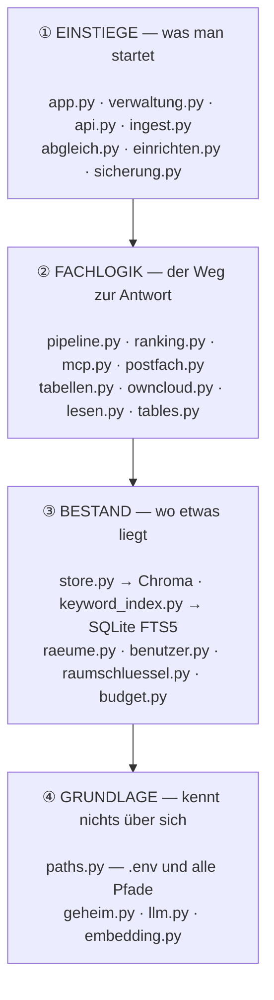
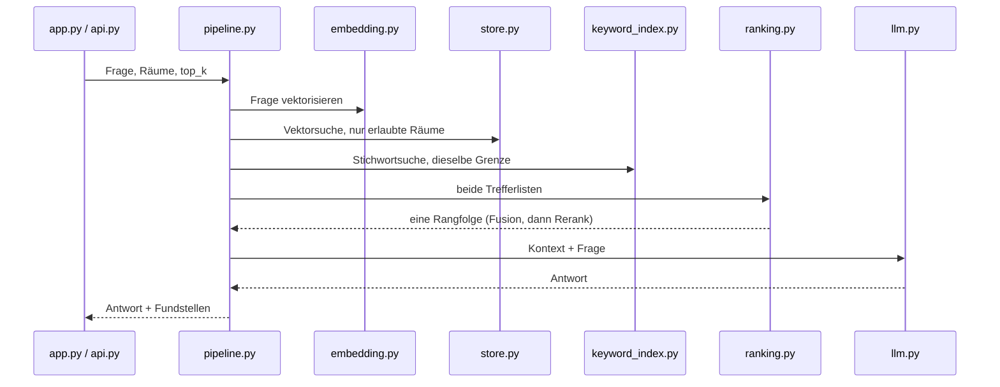
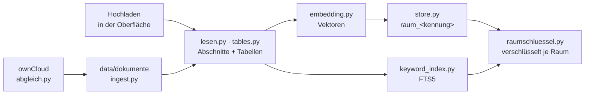

# LocaNoto

Durchsucht Fachdokumente und beantwortet Fragen dazu — mit Angabe der
Fundstelle, Datei und Seite. Die Dokumente werden in Abschnitte zerlegt,
vektorisiert und über zwei Suchwege gefunden; ein Sprachmodell formuliert
daraus die Antwort.

Zur Laufzeit spricht die Anwendung nur mit den Modellservern, die in der
`.env` stehen. Die Dokumente verlassen das eigene Netz nicht.

| | |
|---|---|
| **Suche** | Vektorsuche und Stichwortsuche gemeinsam, verschmolzen und nachbewertet |
| **Formate** | PDF, Word, Markdown, Text — samt Tabellen und Abbildungen |
| **Listen** | `xlsx` und `csv` werden nicht vektorisiert, sondern bei jeder Frage frisch gelesen |
| **Rechte** | Räume mit Mitgliedschaft; jeder Nutzer hat einen eigenen |
| **Vertraulich** | Chatverläufe und Anhänge verschlüsselt, Benutzerdatei signiert |
| **Anbindung** | ownCloud für Dokumente und Gruppen, HTTP-Schnittstelle mit Token |
| **Betrieb** | Docker Compose oder Kubernetes; der Container hält keinen Zustand |

**Bedienen:** [HANDBUCH.md](HANDBUCH.md) — für Nutzer und Verwalter; in LocaNoto eingelesen, beantwortet die Anwendung damit Fragen zu ihrer eigenen Bedienung
**Einrichten:** [mit Docker](#-einrichten-mit-docker) ·
[auf Kubernetes](#-einrichten-auf-kubernetes)
**Verstehen:** [die Landkarte](#-die-landkarte) — was welche Datei tut
**Betreiben:** [Betrieb](#-betrieb) · [Speicherorte](#-speicherorte) ·
[wenn etwas nicht geht](#wenn-etwas-nicht-geht)

---

## 🚀 Einrichten mit Docker

Voraussetzung ist Docker mit Compose und ein erreichbarer Modellserver
für **Chat** und **Embedding** — Ollama, vLLM oder ein Gateway davor.
Ohne ihn startet die Anwendung, findet aber nichts.

Ein **Sehmodell** (Bilder in Dokumenten und im Chat) und ein
**Rerank-Endpunkt** sind optional. Fehlt der Rerank-Endpunkt, greift das
Modell aus dem Abbild; fehlt auch das, rankt allein die Fusion. Keine
dieser Stufen kann den Start verhindern.

### 1. Holen und `.env` anlegen

```bash
git clone https://github.com/mw-research/LocaNoto.git
cd LocaNoto
cp .env.example .env
```

`.env.example` ist ausführlich kommentiert — jeder Wert steht dort mit
dem Grund, warum es ihn gibt. **Nötig sind fünf Einträge**, alles andere
hat Vorgaben:

```ini
OPENAI_BASE_URL=http://192.168.1.10:4000     # Modellserver oder Gateway
OPENAI_API_KEY=dein-schluessel               # bei Ollama beliebig
CHAT_MODEL=qwen3.8:27b                       # antwortet
EMBEDDING_MODEL=qwen3-embedding:8b           # vektorisiert
ADMIN_USERS=markus                           # erster Verwalter, klein
```

Für das mitgelieferte ownCloud kommen sechs dazu:

```ini
OWNCLOUD_URL=http://owncloud:8080
OWNCLOUD_USER=admin
OWNCLOUD_PASSWORT=EIN-STARKES-PASSWORT
OWNCLOUD_ADMIN_USER=admin
OWNCLOUD_ADMIN_PASSWORT=EIN-STARKES-PASSWORT
OWNCLOUD_DB_PASSWORT=EIN-ANDERES-PASSWORT
```

Und auf einem Server gehören Bestand und Konfiguration auf persistenten
Speicher, getrennt voneinander — in `config/` liegt der Schlüssel, mit
dem alle Chatverläufe lesbar sind:

```ini
CHROMA_HOST=chroma                           # Vektordatenbank als Dienst
CHROMA_PORT=8000                             #   sonst schreiben zwei
                                             #   Prozesse dieselben Dateien
DATEN_PFAD=/mnt/speicher/locanoto/daten
KONFIG_PFAD=/mnt/speicher/locanoto/konfig
```

**Blockspeicher, keine Freigabe.** Unter `DATEN_PFAD` liegen zwei
SQLite-Bestände (`chroma_db`, `keyword_index.sqlite3`). Auf NFS oder SMB
ist das kein Fehler, sondern ein beschädigter Index —
[warum](#persistent-ist-nicht-dasselbe-wie-dateifreigabe).

### 2. Starten

```bash
docker compose --profile owncloud up -d
```

Der erste Build lädt das Reranker-Modell in das Abbild (rund 2 GB);
danach braucht der Start dafür keinen Netzzugang mehr.

Wer ein eigenes ownCloud im Haus hat, lässt `--profile owncloud` weg und
trägt dessen Adresse ein. Das Profil sorgt dafür, dass die drei Dienste
(ownCloud, MariaDB, Redis) nur mit dem Profil starten — wer sie nicht
will, merkt nichts von ihnen.

> ownCloud liegt in einem eigenen Abbild: getrennte Prozesse,
> getrennte Protokolle, und ein Update von LocaNoto lässt ownCloud
> unberührt. Es bleibt dieselbe Installation — ein `compose`, ein Netz,
> ein Befehl.

### 3. Einrichten

```bash
docker compose exec locanoto_bot python einrichten.py
```

Ein Lauf, der sagt, was er tut: er wartet, bis ownCloud sich selbst
eingerichtet hat — beim allerersten Start dauert das ein paar Minuten —,
erzeugt den Installationsschlüssel, legt den **ersten Verwalter in
beiden Systemen** an, baut den Ordnerbaum samt Freigaben und zeigt zum
Schluss die Sicherheitslage mit dem, was noch offen ist.

**Wiederholbar.** Was schon steht, bleibt: ein vorhandener Schlüssel wird
nie ersetzt, ein vorhandener Zugang nicht überschrieben, Freigaben werden
gesetzt statt ergänzt. Ein abgebrochener Lauf lässt sich neu starten.

Ohne ownCloud:

```bash
docker compose exec locanoto_bot python einrichten.py --ohne-owncloud
```

Dann liegt derselbe Baum lokal unter `data/dokumente/` — gleiche Namen,
gleiche Aufteilung, nur ohne Freigaben. **Der Rückfall ist kein
Sonderfall**, sondern derselbe Aufbau ohne ownCloud.

### 4. Den Schlüssel sichern — das Einzige, was niemand nachholen kann

```bash
docker compose exec -T locanoto_bot cat /app/config/schluessel.key > ~/locanoto-schluessel.key && chmod 600 ~/locanoto-schluessel.key
```

**Ohne diesen Schlüssel sind alle Chatverläufe und der verschlüsselte
Bestand endgültig unlesbar** — ohne eine einzige Fehlermeldung, denn die
Dateien liegen ja noch da. Er gehört an einen anderen Ort als die
Datensicherung; sonst liegt beides beisammen.

Und in der Seitenleiste unter *Benutzer verwalten* auf **Jetzt
signieren**: danach kann sich ein von Hand in `config/users.json`
eingetragener Zugang nicht mehr anmelden.

### 5. Dokumente einlesen

Dateien nach `data/dokumente/` legen — [ein Raum, ein
Ordner](#-wo-die-dateien-liegen). Dann:

```bash
docker compose exec locanoto_bot python ingest.py
```

Der Lauf ist unterbrechbar und setzt auf Seitenebene wieder auf. Für
Abbildungen zusätzlich `python ingest_images.py`. Beides geht auch über
die Seitenleiste unter *Nachtragen und neu einlesen* und läuft dort
abgekoppelt weiter.

Wer die Dokumente in ownCloud pflegt, überspringt das und richtet den
[Abgleich](#-dokumente-aus-owncloud) ein.

### 6. Prüfliste

Die Oberfläche steht auf `http://localhost:8501`, oder auf dem Port aus
`APP_PORT`. Als Verwalter in der Seitenleiste:

| | soll zeigen |
|---|---|
| *Verschlüsselung* | „an" — sonst fehlt `cryptography` im Abbild |
| *Speicherorte* | Journalmodus `wal` — sonst liegt `data/` auf einer Freigabe |
| *Modell-Endpunkte* | `RANGFOLGE  Endpunkt …` (nicht „Modell aus dem Image") |
| *Benutzer verwalten* | „signiert", Protokollkette in Ordnung |
| *Konfiguration* | erscheint nur, wenn Einträge fehlen oder abweichen |

Dann eine Testfrage. Treffer mit Datei und Seite = fertig.

---

## ☸️ Einrichten auf Kubernetes

Fertige Manifeste liegen unter [`k8s/`](k8s/README.md). Der Pod ist nur
das Gerüst; der ganze Bestand liegt auf zwei Volumes, und zwar in genau
der `data/`-Struktur, die es auch neben der Compose-Datei gibt:

```
Pod locanoto                    PVC locanoto-daten  →  /app/data
 ├── chroma  (Sidecar)              dokumente/  chats/  chroma_db/
 ├── app     (Streamlit)            keyword_index.sqlite3
 └── api     (uvicorn)              tabellen_katalog.json  feedback.jsonl
                                    sicherungen/  owncloud/

                                PVC locanoto-konfig →  /app/config
                                    users.json  tokens.json  schluessel.key
                                    raeume.json  owncloud.json  presets/
```

Nichts im Abbild, nichts im Pod — nachgewiesen: bei einem Durchlauf mit
Anmeldung, Benutzeranlage, Raumanlage, Chat, Rückmeldung, Ingest,
Listenkatalog und Abzug entstand im Abbild keine einzige Datei.

### Der eine Punkt, den du vorher prüfen musst

Das Datenvolume trägt zwei SQLite-Bestände und braucht deshalb **ein
echtes Dateisystem**. `kubectl get storageclass` zeigt, was der Cluster
anbietet:

| Persistenter Speicher | taugt für das Datenvolume |
|---|---|
| angeschlossene Platte, local path | **ja** |
| Ceph RBD, iSCSI, EBS, Azure Disk | **ja** |
| NFS, SMB, CephFS, EFS | **nein** — siehe `k8s/90-variante-freigabe.yaml` |

Persistent heißt nicht automatisch Dateifreigabe, und das ist die
Verwechslung, an der es beim Aufsetzen scheitert. Eine Freigabe trägt
SQLite im WAL-Betrieb nicht, und das Ergebnis ist kein Fehler, sondern
ein beschädigter Index — SQLite fällt dabei **still** auf einen anderen
Journalmodus zurück. Die Oberfläche liest den tatsächlichen Modus zurück
und meldet es unter *Speicherorte*.

### Aufsetzen

```bash
# 1. Abbild bauen und in die Registry des Clusters bringen
docker build -t deine-registry/locanoto:1.0 .
docker push deine-registry/locanoto:1.0

# 2. Geheimnisse aus dem Stand erzeugen -- nicht aus der Vorlage
kubectl create secret generic locanoto \
  --from-literal=OPENAI_API_KEY=... \
  --from-literal=OWNCLOUD_PASSWORT=...

# 3. Speicher, Konfiguration, Pod
kubectl apply -f k8s/10-speicher.yaml
kubectl apply -f k8s/20-konfiguration.yaml   # nur die ConfigMap, siehe Datei
kubectl apply -f k8s/30-anwendung.yaml

# 4. Einrichten -- Schlüssel, erster Verwalter, Ordnerbaum
kubectl exec -it deploy/locanoto -c app -- python einrichten.py

# 5. Optional: nächtlicher Abgleich und Abzug
kubectl apply -f k8s/40-zeitplan.yaml
```

Der Abbildname in den Manifesten ist `locanoto:lokal` — ersetze ihn durch
deinen. Die Manifeste setzen keine `imagePullPolicy`; damit funktioniert ein
lokal gebautes Abbild in einem Einzelknoten-Cluster (k3s, minikube,
Docker Desktop) auch ohne Registry.

### Den Schlüssel sichern

```bash
kubectl exec deploy/locanoto -c app -- cat /app/config/schluessel.key > ~/locanoto-schluessel.key && chmod 600 ~/locanoto-schluessel.key
```

Derselbe Satz wie bei Docker, und er gilt hier genauso: ohne diesen
Schlüssel sind alle Chatverläufe endgültig unlesbar, ohne eine einzige
Fehlermeldung.

| | Verlust bedeutet |
|---|---|
| **der Pod** | nichts |
| `locanoto-konfig` | Nutzer, Räume, **Schlüssel** — alle Chats unlesbar |
| `locanoto-daten` | Dokumente, Chats, Vektoren, Rückmeldungen |

### Chroma als Sidecar

Chroma läuft als eigener Prozess im selben Pod und lauscht nur auf
`127.0.0.1`. Ohne ihn schreiben Oberfläche und Schnittstelle gleichzeitig
in dieselben SQLite-Dateien; das Ergebnis ist kein Fehler, sondern ein
beschädigter Index. Als Dienst entscheidet Chroma, wer schreibt.
`api.py` bricht deshalb beim Start ab, wenn kein `CHROMA_HOST` gesetzt
ist.

### Eine Instanz

`replicas: 1`. Das Volume ist
`ReadWriteOnce`, Streamlit hält den Sitzungszustand im Arbeitsspeicher,
PID-Dateien gelten nur auf ihrem Rechner. Mehrere Instanzen bräuchten
Stichwortindex und Sitzungszustand in einer Server-Datenbank — ein Umbau.
Für eine interne Wissenssuche ist die Modellzeit der Engpass, nicht die
Anwendung: [`lasttest.py`](lasttest.py) misst den Eigenanteil der
Anwendung an einer Antwort, und der bleibt von 2 bis 32 gleichzeitigen
Fragen flach.

---

## 🗺️ Die Landkarte

Gut sechzig Dateien. Dieser Abschnitt nennt für jede, was sie tut,
welche Werte sie aus der `.env` liest und welche Dateien sie benutzen.

Er wird erzeugt, nicht gepflegt:

```bash
python landkarte.py              # die Übersicht
python landkarte.py --tabelle    # die Tabelle unten
```

Der Selbsttest prüft, dass jede Datei hier aufgeführt ist.

### Vier Schichten, und keine Kante zeigt nach oben



Pfeile heißen „benutzt". **Keine einzige zeigt nach oben** — gemessen,
nicht behauptet, und der Selbsttest prüft es. Das ist die Eigenschaft,
an der die Wartbarkeit hängt: wer `paths.py` ändert, muss nichts über
die Oberfläche wissen; wer die Oberfläche ändert, kann den Bestand nicht
aus Versehen umbauen.

| Schicht | Umfang | Regel |
|---|---|---|
| ① Einstiege | gut die Hälfte | wird gestartet oder gezeichnet; keine tiefere Schicht kennt sie |
| ② Fachlogik | rund ein Drittel | kennt den Bestand, nicht die Oberfläche |
| ③ Bestand | sechs Dateien | weiß, wo etwas liegt und wer es sehen darf |
| ④ Grundlage | vier Dateien | kennt nur sich selbst und die `.env` |

Genaue Zahlen nennt `python landkarte.py` — im README stünden sie nach
der nächsten Datei falsch.

### Der Weg einer Frage

Derselbe für die Oberfläche und für die Schnittstelle: beide rufen
`pipeline.py`. Eine Antwort über HTTP ist damit dieselbe wie im
Browser.



**Die Rechtegrenze wird in beiden Suchwegen einzeln gezogen** — Vektor-
und Stichwortsuche filtern jeweils selbst.

**`ranking.py` fällt stufenweise zurück**: Endpunkt, sonst das Modell aus
dem Abbild, sonst allein die Fusion. Keine dieser Stufen kann eine
Antwort verhindern.

### Der Weg eines Dokuments



Drei Wege hinein, **ein** Weg hinaus: alles landet über `store.schreibe`
in der Sammlung des Raums. Deshalb hängt die Abwehr doppelter Kennungen
auch dort und nicht an drei Stellen.

### Was man starten kann

| Befehl | wofür |
|---|---|
| `python einrichten.py` | Von null auf lauffähig — Schlüssel, erster Verwalter, Ordnerbaum |
| `python ingest.py` | Dokumente einlesen; `INGEST_RAUM` setzt den Zielraum |
| `python ingest_images.py` | Abbildungen beschreiben und durchsuchbar machen |
| `python abgleich.py --pruefen` | Was hat sich in ownCloud geändert? Fasst nichts an |
| `python abgleich.py` | Gruppen, dann Dateien, dann einlesen |
| `python sicherung.py` | Abzug der Vektordatenbank, ohne Modell zurückspielbar |
| `python bestandsliste.py` | Was liegt in dieser Installation? |
| `python selbsttest.py` | Stehen die Grundfunktionen? |
| `python landkarte.py` | Diese Übersicht, aus dem Code gelesen |
| `python lasttest.py` | Wie viele Leute gleichzeitig? |
| `python mcp.py` | Was bietet ein angebundener Werkzeugserver an? |
| `python postfach.py <name>` | Steht die Anmeldung an einem Exchange-Postfach? |
| `python create_token.py` | Zugangstoken für die Schnittstelle |
| `python raum_diagnose.py` | Warum ist ein eingelesenes Dokument nicht abrufbar? |
| `python listen_diagnose.py` | Warum findet die Listenabfrage nichts? |
| `python was_sieht_die_platte.py` | Was liest jemand, der die Platte hat, aber nicht den Schlüssel? |

### Wohin die Variablen gehen

108 Einträge kann die `.env` haben. **96 davon werden an genau einer
Stelle gelesen** — wer wissen will, was ein Wert bewirkt, findet genau
eine Datei. Die zwölf Ausnahmen:

| Variable | gelesen in | Grund |
|---|---|---|
| `OPENAI_BASE_URL`, `OPENAI_API_KEY` | `llm`, `ranking` | der Rerank-Endpunkt darf ein anderer sein und fällt sonst hierauf zurück |
| `LOCANOTO_SCHLUESSEL`, `LOCANOTO_SCHLUESSEL_DATEI` | `geheim`, `sicherheit` | `sicherheit` meldet, **woher** der Schlüssel kommt, ohne ihn zu benutzen |
| `INGEST_RAUM`, `INGEST_ORDNER` | `ingest`, `ingest_images` | zwei Läufe mit derselben Steuerung |
| `MIN_AREA`, `MIN_LONG_EDGE` | `bildtext`, `ingest_images` | dieselbe Schwelle beim Hochladen und im Stapellauf |
| `VISION_TIMEOUT` | `vision`, `ingest_images` | eine Frage darf kürzer warten als ein Nachtlauf |
| `TOP_K` | `api`, `app`, `selbsttest` | Vorgabe für beide Oberflächen; der Selbsttest prüft sie |
| `HELPER_TIMEOUT` | `app`, `pipeline` | dieselbe Grenze für Vorstufen und Nebenläufe |
| `TABELLEN_PFAD` | `paths`, `tabellen` | `paths` legt den Ort fest, `tabellen` liest ihn |

Alles Übrige steht in [`.env.example`](.env.example), kommentiert mit dem
Grund, warum es den Eintrag gibt. Was in der eigenen `.env` fehlt oder
abweicht, zeigt die Oberfläche unter *Konfiguration* — nur Namen, keine
Werte.

### Jede Datei in einem Satz

Erzeugt mit `python landkarte.py --tabelle`. „Liefert an" heißt: diese
Dateien importieren sie.

| Datei | Aufgabe | liest aus der `.env` | liefert an |
|---|---|---|---|
| **Grundlage** | | | |
| `paths.py` | Zentrale Pfad-Definition und Bootstrap. | `LOCANOTO_DATEN`, `LOCANOTO_INDEX`, `LOCANOTO_KONFIG` +1 | `abgleich`, `api`, `app`, `aufnehmen` +46 |
| `geheim.py` | Installationsschluessel: verschluesseln, entschluesseln, signieren. | `LOCANOTO_SCHLUESSEL`, `LOCANOTO_SCHLUESSEL_DATEI` | `api`, `app`, `auth`, `benutzer` +12 |
| `embedding.py` | Embedding-Aufrufe, gebuendelt. | `EMBED_BATCH_SIZE`, `EMBED_MIN_CHARS`, `EMBED_PARALLEL` +1 | `app`, `aufnehmen`, `ingest`, `ingest_images` +1 |
| `dateisperre.py` | Eine Datei aendern, ohne dass ein gleichzeitiger Schreiber es verschluckt. | — | `auth`, `benutzer`, `chats`, `feedback` +11 |
| `llm.py` | Modell-Endpunkte je Aufgabe. | `LLM_VERSUCHE`, `OPENAI_API_KEY`, `OPENAI_BASE_URL` | `api`, `app`, `aufnehmen`, `ingest` +3 |
| **Bestand** | | | |
| `benutzer.py` | Benutzer, Rollen und ein Protokoll, das Aenderungen sichtbar macht. | `ADMIN_USERS`, `SITZUNG_MERKEN_STUNDEN` | `abgleich`, `api`, `app`, `bestandsliste` +10 |
| `raeume.py` | Raeume: wer darf welche Abschnitte sehen. | `OWNCLOUD_GRUPPEN_HOECHSTALTER`, `PRIVAT_STRENG` | `abgleich`, `api`, `app`, `aufnehmen` +19 |
| `store.py` | Zugang zur Vektordatenbank -- an einer Stelle. | `CHROMA_CLOUD_DATABASE`, `CHROMA_CLOUD_KEY`, `CHROMA_CLOUD_TENANT` +6 | `api`, `app`, `aufnehmen`, `bestandsliste` +10 |
| `keyword_index.py` | Plattenbasierter Keyword-Index auf SQLite FTS5. | `LOCANOTO_STICHWORTINDEX` | `app`, `aufnehmen`, `ingest`, `ingest_images` +8 |
| `budget.py` | Wie viel darf in einer Stunde entschluesselt werden -- und wer merkt es. | `BUDGET_ABSCHNITTE`, `BUDGET_FENSTER_MINUTEN`, `BUDGET_RAEUME` +1 | `api`, `app`, `selbsttest`, `sicherheit` +1 |
| `raumschluessel.py` | Je Raum ein eigener Schluessel -- verpackt mit dem Installationsschluessel. | — | `app`, `keyword_index`, `selbsttest`, `sicherheit` +3 |
| **Fachlogik** | | | |
| `tabellen.py` | Listen aus Tabellendateien -- Katalog und Abfrage. | `TABELLEN_BEISPIELE`, `TABELLEN_BEISPIELE_BIS`, `TABELLEN_BLAETTER` +9 | `api`, `app`, `listen_diagnose`, `selbsttest` +1 |
| `owncloud.py` | Dokumente aus ownCloud oder Nextcloud holen -- je Raum ein Ordner. | `OWNCLOUD_ADMIN_PASSWORT`, `OWNCLOUD_ADMIN_USER`, `OWNCLOUD_PASSWORT` +4 | `abgleich`, `app`, `aufnehmen`, `einrichten` +6 |
| `mcp.py` | Werkzeugserver nach dem Model-Context-Protocol anbinden. | `MCP_MAX_WERKZEUGE`, `MCP_TIMEOUT` | `app`, `pipeline`, `postfach`, `selbsttest` +1 |
| `pipeline.py` | Suche und Antwort -- unabhaengig von der Oberflaeche. | `ANSWER_TIMEOUT`, `EXPERT_ROLE`, `HELPER_TIMEOUT` +2 | `api`, `app`, `raum_diagnose`, `selbsttest` +1 |
| `postfach.py` | Exchange-Postfaecher direkt anbinden, ohne Server dazwischen. | `POSTFACH_HOLGRENZE`, `POSTFACH_TEXTAUSZUG`, `POSTFACH_TIMEOUT` | `mcp`, `selbsttest` |
| `ranking.py` | Kandidaten aus Vektor- und Keyword-Suche zu einer Rangfolge verschmelzen. | `OPENAI_API_KEY`, `OPENAI_BASE_URL`, `RERANKER_API_KEY` +9 | `api`, `app`, `pipeline`, `selbsttest` |
| `listenquellen.py` | Woher die Listen kommen -- und wer welche sieht. | `LISTEN_WURZELN` | `app`, `selbsttest`, `tabellen`, `verwaltung` |
| `aufnehmen.py` | Ein Dokument aufnehmen -- fuer beide Eingaenge derselbe Weg. | — | `api`, `app`, `selbsttest` |
| `feedback.py` | Rueckmeldungen zu Antworten -- was gefehlt hat und was gewirkt hat. | `FEEDBACK_ANZEIGE` | `api`, `app`, `selbsttest`, `verwaltung` |
| `chats.py` | Chatverlaeufe -- verschluesselt, mit dem Titel in der Datei statt im Namen. | — | `app`, `selbsttest`, `verwaltung` |
| `notzugang.py` | Notzugang zu einem persoenlichen Raum -- von zwei Personen getragen. | `NOTZUGANG_ANTRAG_TAGE`, `NOTZUGANG_STUNDEN` | `app`, `selbsttest`, `verwaltung` |
| `sqldb.py` | Lesender Zugriff auf eine SQL-Server-Datenbank fuer Text-to-SQL. | `SQL_DB`, `SQL_HINWEIS`, `SQL_MAX_ROWS` +7 | `app`, `selbsttest` |
| `tables.py` | Tabellen-Chunks bauen: Ueberschrift davor, uebergrosse Tabellen aufteilen. | `CAPTION_HEIGHT`, `MAX_TABLE_CHARS` | `app`, `aufnehmen`, `ingest`, `ingest_images` |
| `auth.py` | Zugangstoken fuer die Schnittstelle. | — | `api`, `app`, `create_token`, `selbsttest` +1 |
| `sqlquellen.py` | Wer sich mit welchem Konto an der Fachdatenbank anmeldet. | — | `app`, `selbsttest`, `verwaltung` |
| `lesen.py` | Word, Markdown und einfache Textdateien in Abschnitte zerlegen. | — | `app`, `aufnehmen`, `ingest`, `ingest_images` +1 |
| `vision.py` | Bilder aus dem Chat beschreiben lassen. | `CHAT_BILD_MAX_KANTE`, `VISION_MAX_TOKENS`, `VISION_TIMEOUT` | `app`, `bildtext` |
| `bildtext.py` | Was auf einem Bild steht, als Text -- beim Hochladen. | `BILD_MINDEST_TEXT`, `BILD_SEITEN_DPI`, `MIN_AREA` +1 | `app`, `aufnehmen`, `selbsttest` |
| `sqlpruefung.py` | Pruefung und Aufbereitung erzeugter SQL-Abfragen. | — | `api`, `app`, `sqldb`, `tabellen` |
| `prompts.py` | Prompt-Vorlagen lesen, pruefen und ablegen. | — | `app`, `verwaltung` |
| `datentraeger.py` | Liegt ein Verzeichnis auf einem verschluesselten Datentraeger? | — | `sicherheit` |
| `hintergrund.py` | Lange Laeufe aus der Oberflaeche anstossen und beobachten. | — | `app`, `verwaltung` |
| `sicherheit.py` | Die Sicherheitslage auf einem Bildschirm -- ehrlich, nicht beruhigend. | `LOCANOTO_SCHLUESSEL`, `LOCANOTO_SCHLUESSEL_DATEI` | `app`, `einrichten`, `selbsttest`, `verwaltung` |
| `presets.py` | Voreinstellungen: benannte Buendel aus Modell, Umfang und Formulierung. | — | `api`, `app`, `pipeline`, `prompts` +1 |
| `envcheck.py` | Vergleicht die .env mit der mitgelieferten Vorlage. | — | `app`, `verwaltung` |
| `quellticket.py` | Ein Ticket fuer genau eine Fundstelle, fuer kurze Zeit. | `QUELLE_TICKET_MINUTEN` | `app`, `selbsttest` |
| `textutils.py` | Textbereinigung fuer den Ingest. | — | `app`, `aufnehmen`, `ingest`, `tables` |
| **Einstiege** | | | |
| `selbsttest.py` | Stehen die Grundfunktionen? -- python selbsttest.py | `TOP_K` | — |
| `app.py` | Die Oberflaeche -- Anmeldung, Seitenleiste, Chat und Quellen. | `APP_TOPIC`, `COMPANY_NAME`, `HELPER_TIMEOUT` +3 | — |
| `verwaltung.py` | Der Verwaltungsbereich der Seitenleiste. | — | `app` |
| `sicherung.py` | Die Vektordatenbank sichern und zurueckholen -- ohne Modell. | `SICHERUNG_BEHALTEN`, `SICHERUNG_PFAD` | `app`, `selbsttest`, `verwaltung` |
| `api.py` | HTTP-Schnittstelle zu derselben Suche, die auch die Oberflaeche benutzt. | `API_WURZELPFAD`, `AUFNAHME_MAX_MB`, `CHROMA_EINZELN` +1 | — |
| `ingest_images.py` | Abbildungen aus PDFs beschreiben und durchsuchbar machen. | `INGEST_ORDNER`, `INGEST_RAUM`, `MIN_AREA` +6 | — |
| `ingest.py` | Batch-Vektorisierung der PDFs aus data/dokumente. | `INGEST_ORDNER`, `INGEST_RAUM`, `MAX_KOPFZEILE_CHARS` | — |
| `einrichten.py` | Von null auf lauffaehig -- ein Lauf, der sagt, was er tut. | `APP_PORT`, `KUBERNETES_SERVICE_HOST`, `LOCANOTO_ERSTER_VERWALTER` +1 | — |
| `was_sieht_die_platte.py` | Was liest jemand, der die Platte hat -- aber nicht den Schluessel? | — | — |
| `lasttest.py` | Wie viele Leute gleichzeitig? -- python lasttest.py | — | `selbsttest` |
| `abgleich.py` | Aus ownCloud abgleichen: Gruppen, Dokumente, Einlesen. | — | — |
| `spiegeln.py` | Vorhandene Dokumente nach ownCloud hochladen -- python spiegeln.py | — | `selbsttest` |
| `bestandsliste.py` | Was liegt in dieser Installation? -- python bestandsliste.py | — | `selbsttest` |
| `listen_diagnose.py` | Warum findet die Listenabfrage nichts? | — | — |
| `manage_users.py` | Benutzerverwaltung im Terminal -- nur fuer angemeldete Verwalter. | — | — |
| `landkarte.py` | Was macht welche Datei, und woher kommt ihr Wert? | — | `selbsttest` |
| `create_token.py` | Zugangstoken fuer die Schnittstelle anlegen, auflisten, widerrufen. | — | — |
| `raum_diagnose.py` | Warum ist ein eingelesenes Dokument nicht abrufbar? | — | — |
| `packe_umzug.py` | Packt den Bestand einer bestehenden Installation fuer den Umzug. | — | `selbsttest` |
| `create_user.py` | Ersten Benutzer anlegen -- und danach nur noch als Verwalter. | — | — |
| `pruefe_env.py` | Liest der Code eine Variable, die die Compose-Datei nicht durchreicht? | — | — |
| `lizenzen.py` | Die Lizenzen der Abhaengigkeiten -- gegen die GEPINNTEN Fassungen. | — | — |
| `rebuild_index.py` | Baut den Keyword-Index aus der bestehenden Vektordatenbank neu auf. | — | — |

---

## ⚙️ Betrieb

### Nach einem Rebuild

```bash
docker compose up -d --build
```

erzeugt den Container **neu**. Alle offenen Streamlit-Sitzungen sterben
mit ihm. Der Browser zeigt die alte Seite weiter, aber die Verbindung
dahinter ist tot — Eingaben laufen ohne Fehlermeldung ins Leere. Das
sieht aus wie ein Absturz und ist keiner: **Seite neu laden**, dann
erneut anmelden. In Kubernetes gilt dasselbe für
`kubectl rollout restart`.

### Nach einem Update: Selbsttest

```bash
python selbsttest.py
```

Läuft über den echten Suchpfad — echte Sammlungen, echter Stichwortindex,
echte Verschlüsselung, echte Rechteprüfung. Attrappen sind nur Embedding-
und Rerank-Modell, damit er ohne Modellserver in Sekunden durchläuft. Er
arbeitet in einem eigenen Verzeichnis und lässt den Bestand unberührt.

Läuft er durch, stehen: Anmeldung und Rollen, Raumtrennung (auch dass ein
Nutzer fremde Räume **nicht** sieht), Suche mit Quellenangabe,
Chatverschlüsselung, Rückmeldungen, der Abzug samt Einspielen ohne Modell
— und die Landkarte, also dass jede Datei eine Schicht hat und keine
Kante nach oben zeigt.

Die Zahl der Prüfungen nennt der Lauf selbst.

### Wenn etwas nicht geht

| Symptom | Ursache |
|---|---|
| Suche hängt nach den Sonden | Modellserver kalt oder nicht erreichbar. Die Meldung nennt den Grund; `SUCHE_EMBED_TIMEOUT` steuert die Wartezeit. |
| „RANGFOLGE Modell aus dem Image" | Rerank-Endpunkt nicht erreichbar. Grund steht in derselben Zeile. |
| Journalmodus nicht `wal` | `data/` liegt auf einer Dateifreigabe. Siehe [Speicherorte](#-speicherorte). |
| Abzug heißt „UNVOLLSTÄNDIG" | Ein Raum ließ sich beim Sichern nicht lesen. Neu sichern; der letzte vollständige wird nicht weggeräumt. [Details](#die-vektordatenbank-sichern) |
| Quellenansicht zeigt keine Seite | Die Datei liegt im Ordner eines anderen Raums — beim Verschieben war am Ziel eine gleichnamige. Die Meldung nennt es. |
| „Benutzerdatei außerhalb der Anwendung geändert" | Signatur passt nicht. Bestehende Nutzer arbeiten weiter, neue Einträge sind gesperrt. |
| Rechte- oder Modellprobleme unklar | Seitenleiste → *Konfiguration* zeigt fehlende und abweichende Einträge (nur Namen, keine Werte). |
| Ein Dokument ist eingelesen und nicht auffindbar | `python raum_diagnose.py` |

---


## 📥 Dokumente einlesen
```bash
python ingest.py          # Text und Tabellen
python ingest_images.py   # Abbildungen über das Vision-Modell
```

Der Bildlauf gibt dem Sehmodell die Bildunterschrift und den umgebenden Text
mit. Ohne sie sieht das Modell nur den freigeschnittenen Ausschnitt und
beschreibt Geometrie statt Bedeutung — welche Größe auf einer Achse steht und
zu welchem Regelwerk die Abbildung gehört, ist außerhalb des Bildes notiert.
Der Kontext steht auch im gespeicherten Chunk, denn er ist der Suchanker.

Beide Läufe sind unterbrechbar und setzen auf Chunk-Ebene wieder auf: die
Textextraktion läuft erneut — sie dauert nur Millisekunden pro Seite.
Vektorisiert wird nur, was fehlt; das ist der zeitintensive Teil. Ein
abgebrochener Lauf hinterlässt damit kein halb indexiertes
Dokument, das beim nächsten Start als erledigt gilt.

Stammt die Vektordatenbank aus einer Installation vor dem FTS5-Index, baut
die App ihn beim ersten Start automatisch auf. Vorab und außerhalb der
Weboberfläche geht das mit:

```bash
python rebuild_index.py
```

### Nachtragen und neu einlesen

Der Upload vektorisiert Text und Tabellen. **Bilder bleiben außen vor** —
eine Beschreibung dauert je nach Sehmodell Minuten, und ein Dokument mit
zehn Abbildungen würde den Upload-Knopf eine Stunde blockieren.

Verwalter stoßen die beiden langen Läufe deshalb in der Seitenleiste unter
**🔄 Nachtragen und neu einlesen** an:

| Knopf | was er tut |
|---|---|
| Bilder nachtragen | `ingest_images.py` — beschreibt Bilder aus PDFs und Word-Dateien |
| Dokumente neu einlesen | `ingest.py` — vektorisiert alles im Dokumentenordner |

Beide laufen als **eigener Vorgang**: die Oberfläche bleibt benutzbar, ein
Neuladen oder Abmelden beendet sie nicht. Bereits Verarbeitetes wird
übersprungen, ein Abbruch kostet also nur Zeit. Während ein Lauf aktiv ist,
zeigt der Abschnitt die letzten Protokollzeilen und bietet **Abbrechen**;
die Anzeige aktualisiert sich beim nächsten Klick.

Ein zweiter Start desselben Laufs wird abgelehnt, solange der erste läuft.

Was es nicht gibt: eine Warteschlange, mehrere gleichzeitige Läufe, oder
eine Wiederaufnahme nach einem Neustart des Containers. Das wäre ein
Arbeiter neben der Anwendung — etwas anderes als ein Knopf.


## ☁️ Dokumente aus ownCloud
**LocaNoto steht vorn, ownCloud liegt dahinter.** Wer hier einen Zugang
anlegt, bekommt ihn dort auch; wer hier einen Raum anlegt, bekommt dort
einen Ordner samt Freigabe. Niemand muss in ownCloud etwas einrichten,
und niemand muss dort etwas von Räumen wissen.

Der Baum gehört dem **Dienstkonto** und wird nach außen geteilt:

```
/LocaNoto/allgemein/          für alle lesbar, Verwalter schreiben
/LocaNoto/raeume/einkauf/     für die Mitglieder des Raums
/LocaNoto/privat/anna/        nur für anna
```

Ein Ordner im **eigenen** Bereich des Nutzers wäre für LocaNoto
unsichtbar: WebDAV
kennt nur den Bereich des angemeldeten Kontos, und weder ownCloud noch
Nextcloud lassen einen Verwalter fremde Dateien darüber lesen. Ein
persönlicher Raum, den die Anwendung nicht durchsuchen kann, wäre aber
kein Raum, sondern ein Ordner.

Derselbe Baum steht ohne ownCloud unter `data/dokumente/` — gleiche
Namen, gleiche Aufteilung. **Der Rückfall ist kein Sonderfall**, sondern
derselbe Aufbau ohne Freigaben. Die Mitgliederliste im Raum entscheidet
in beiden Fällen; eine ownCloud-Gruppe kommt nur hinzu, sie ersetzt
nichts.

### Was das Dienstkonto können muss

Einzurichten in der `.env`: `OWNCLOUD_URL` (die **Wurzel** der
Installation, nicht der WebDAV-Pfad), `OWNCLOUD_USER`,
`OWNCLOUD_PASSWORT`. Bei aktiver Zwei-Faktor-Anmeldung braucht es ein
**App-Passwort**, nicht das Anmeldepasswort.

| Was | Welches Recht |
|---|---|
| Dateien holen und abgleichen | Lesezugriff genügt |
| Konten anlegen, Ordner erzeugen, freigeben | `OWNCLOUD_ADMIN_USER` braucht **Verwalterrechte** |

Das ist viel Macht in einem Dienstkonto, und das gehört gesagt: wer sie
nicht geben will, richtet Konten und Ordner in ownCloud von Hand ein und
trägt hier nur die Zuordnung ein. Das Holen läuft dann unverändert.

`OWNCLOUD_WURZEL` verschiebt den Baum, Vorgabe `LocaNoto`.

### Zuordnung von Hand

Eine Zuordnung von Hand geht dem Standardbaum vor — für Unterlagen, die
an einem gewachsenen Ort wie `/Abteilungen/Einkauf/Handbücher` gepflegt
werden. Sie steht in `config/owncloud.json` und lässt sich in der
Seitenleiste unter **ownCloud** setzen. Ohne Eintrag gilt der
Standardbaum, und dann muss für einen neuen Raum niemand etwas eintragen.

**Ablage einrichten** in derselben Seitenleiste holt nach, was beim
Anlegen nicht ging — etwa weil ownCloud gerade nicht erreichbar war. Der
Ablauf ist
wiederholbar: vorhandene Ordner bleiben, Freigaben werden auf den
Soll-Stand **gesetzt**, nicht ergänzt. Das ist der Unterschied, an dem es
sonst scheitert: wer aus einem Raum ausscheidet, verliert damit auch den
Ordner. Eine Mitgliedschaft zu entfernen und die Freigabe stehen zu
lassen wäre die häufigste Art, eine Rechteänderung wirkungslos zu machen
— die Suche fragt den Raum nicht mehr, die Dateien lägen aber weiter im
ownCloud des Ausgeschiedenen.

### Prüfen, dann abgleichen

```bash
docker compose exec locanoto_bot python abgleich.py --pruefen
```

zeigt, was sich geändert hat, und **fasst nichts an**. Das ist der Lauf für
eine neue Zuordnung: ein falsch eingerichteter Ordner sieht sonst genau wie
„alles gelöscht" aus — der Ordner ist leer, also gilt jede bekannte Datei
als entfallen, und danach sind die Abschnitte weg.

```bash
docker compose exec locanoto_bot python abgleich.py
```

holt neue und geänderte Dateien, entfernt die Abschnitte entfallener und
liest anschließend ein. Über die Oberfläche geht dasselbe abgekoppelt, unter
*Nachtragen und neu einlesen* → „Aus ownCloud abgleichen".

Für den Dauerbetrieb in einen Zeitplan auf dem Server:

```
0 3 * * *  docker compose exec -T locanoto_bot python abgleich.py
```

### Was der Abgleich erkennt

Verglichen wird über `ETag` und Größe, nicht über das Änderungsdatum — ein
zurückgesetztes Datum wäre sonst eine unbemerkt veraltete Fassung.

| Fall | Folge |
|---|---|
| neue Datei | holen, einlesen |
| geänderter `ETag` | neu holen, neu einlesen |
| Datei verschwunden | lokal löschen **und die Abschnitte entfernen** |
| lokal fehlt, entfernt vorhanden | gilt als neu |
| unverändert | nichts |

Die dritte Zeile ist die wichtige. Bleiben die Abschnitte stehen, antwortet
die Anwendung weiter aus Dokumenten, die es nicht mehr gibt — bei einer
DSGVO-Betrachtung der Punkt, der zuerst auffällt. `--ohne-loeschen` setzt
das für den ersten Lauf aus.

Dateinamen kommen vom Server und werden entschärft, bevor daraus ein Pfad
wird: `../../etc/passwd` landet als `etc/passwd` im Zwischenspeicher des
Raums und nicht daneben.

### Mitgliedschaft aus ownCloud-Gruppen

Zwei Brücken, und die zweite ist die, ohne die die erste halb bliebe:

```
Ordner → Raum     welche Sammlung eine Datei füllt
Gruppe → Raum     wer die Abschnitte dieser Sammlung sieht
```

Ohne die zweite lägen die Dateirechte in ownCloud und die
Abschnittsrechte in einer Datei daneben — ein Abteilungswechsel hätte die
eine Seite geändert und die andere nicht.

Eingetragen wird die Gruppe **am Raum selbst**, unter *Räume verwalten* →
„ownCloud-Gruppe". Nicht in einer zweiten Zuordnungsdatei: ein Raum, dessen
Mitgliedschaft aus einer Gruppe kommt, soll das an einer Stelle sagen.

Die Gruppenmitglieder kommen zu den von Hand eingetragenen **hinzu**, sie
ersetzen sie nicht. Sonst könnte sich ein Verwalter selbst aussperren,
indem er eine Gruppe einträgt, in der die Firma ihn nicht führt.

Die Gruppenabfrage läuft über die Provisioning-Schnittstelle (OCS) und
verlangt dort ein Konto mit **Verwalterrechten** — für das Holen der
Dateien genügt Lesen. Deshalb getrennt setzbar: `OWNCLOUD_ADMIN_USER` und
`OWNCLOUD_ADMIN_PASSWORT`.

```bash
docker compose exec locanoto_bot python abgleich.py --nur-gruppen
```

Abgeglichen wird nur, was zugeordnet ist. Die Mitgliederliste jeder Gruppe
der Firma abzulegen wäre eine Sammlung personenbezogener Daten, für die es
keinen Anlass gibt.

Passen die Kennungen in ownCloud nicht zu den hier angelegten, sieht alles
richtig aus und niemand kommt herein — der Abgleich nennt deshalb, welche
Kennungen er gefunden hat, die es hier nicht gibt, und die Oberfläche
markiert sie am Raum.

### Der Preis: Aktualität

Gelesen wird ein Zwischenspeicher, nicht ownCloud. Eine HTTP-Anfrage je
Frage wäre ein Rundlauf je Suchsonde, und bei nicht erreichbarem ownCloud
stünde die Suche.

Dafür gilt: **wer aus einer Gruppe entfernt wird, kommt bis zum nächsten
Abgleich noch herein.** Das Alter des Standes steht in der Oberfläche.

`OWNCLOUD_GRUPPEN_HOECHSTALTER` (Minuten) lässt einen zu alten Stand
verfallen. Das ist eine Abwägung ohne richtige Antwort, und sie gehört dem
Betreiber:

| | verfällt nicht (Vorgabe) | verfällt |
|---|---|---|
| ownCloud nicht erreichbar | alle arbeiten weiter | Abteilungsräume gesperrt |
| Mitarbeiter ausgeschieden | Zugang bis zum Abgleich | Zugang endet mit dem Höchstalter |

Voreingestellt ist „arbeitsfähig bleiben", weil eine ausgesperrte Firma in
den meisten Häusern der schwerere Ausfall ist. Von Hand eingetragene
Mitglieder und der eigene Raum sind davon **nie** betroffen — ein
verfallener Stand nimmt niemandem seine eigenen Unterlagen.

### Was ownCloud nicht löst

* **Die Anmeldung läuft weiter über `config/users.json`**, nicht über
  ownCloud oder das Verzeichnis der Firma. Ein Nutzer muss hier angelegt
  sein, damit seine Gruppenmitgliedschaft überhaupt wirkt. Das ist der
  nächste Schritt (OIDC/LDAP) — danach entfällt die zweite
  Nutzerverwaltung.
* **Gruppenänderungen wirken erst beim Abgleich**, siehe oben.


## 💾 Speicherorte
Nichts, was nicht der Container selbst ist, liegt im Container. Drei
Wurzeln, jede einzeln setzbar — nicht aus Ordnungsliebe, sondern weil sie
verschiedene Anforderungen haben.

| Wurzel | Inhalt | gehört auf |
|---|---|---|
| `DATEN_PFAD` | Dokumente, Chats, Rückmeldungen, Protokolle | persistenten Speicher |
| `KONFIG_PFAD` | Nutzer, Token, Schlüssel, Räume, Prompts | persistenten Speicher, **getrennt** |
| `LOCANOTO_INDEX` | Vektordatenbank, Stichwortindex, Listenkatalog, PID-Dateien | persistenten **Blockspeicher**, keine Dateifreigabe |

`DATEN_PFAD` und `KONFIG_PFAD` sind Pfade auf dem **Host** — sie sagen, was
eingehängt wird. `LOCANOTO_INDEX` ist ein Pfad **im Container**. Wer das
verwechselt, bekommt eine laufende Anwendung am falschen Ort.

Konfiguration getrennt von Daten, weil dort der Schlüssel liegt, mit dem
alle Chatverläufe lesbar sind. Eine Sicherung der Dokumente soll ihn nicht
mitnehmen: andere Rechte, andere Aufbewahrung.

Zu sehen ist der ganze Zustand in der Seitenleiste unter **Speicherorte** —
Klasse, Ort, Größe. Bei einer Frage nach der Datenhaltung ist „schau in die
`docker-compose.yaml` und in fünf Module" keine Antwort.

### Persistent ist nicht dasselbe wie Dateifreigabe

Das ist die Unterscheidung, an der es beim Aufsetzen am häufigsten
scheitert — und sie ist **nicht** „Datenbank in den Container":

| Speicher | Dokumente, Chats, Konfiguration | Vektordatenbank, Stichwortindex |
|---|---|---|
| Blockspeicher (Ceph RBD, iSCSI, EBS, local PV, angeschlossene Platte) | geht | **richtig** |
| Freigabe (NFS, SMB, CephFS, EFS) | **richtig** | **beschädigt den Index** |
| im Container | nein | nein |

**SQLite und Netzlaufwerke.** Vektordatenbank und Stichwortindex sind
SQLite-Dateien. Der WAL-Betrieb braucht gemeinsamen Speicher im selben
Dateisystem; über NFS oder SMB gibt es den nicht, und die Dateisperren sind
unzuverlässig. Das Ergebnis ist kein Fehler, sondern ein beschädigter
Index — und SQLite fällt dabei **still** auf einen anderen Journalmodus
zurück. `PRAGMA journal_mode=WAL` schlägt nicht fehl, es bleibt einfach beim
alten Modus. Die Oberfläche liest den tatsächlichen Modus zurück und
meldet, wenn es nicht `wal` ist.

**Und im Container gehört es auch nicht hin.** Dessen Schreibschicht
überlebt einen Neustart des Pods nicht — der Bestand wäre nach jedem
Ausrollen weg. `LOCANOTO_INDEX` zeigt deshalb auf ein benanntes Volume
(docker compose) beziehungsweise auf ein PersistentVolume mit
`ReadWriteOnce` (Kubernetes, siehe [`k8s/`](k8s/README.md)).

Zwei Dinge müssen zusammenkommen: ein echtes Dateisystem, und **genau ein
schreibender Prozess**. Deshalb läuft die Vektordatenbank ab einer Instanz
mit Schnittstelle als eigener Dienst (`CHROMA_HOST`) mit eigenem Volume —
dann entscheidet sie selbst, wer schreibt, statt dass es der Zufall tut.

**Prozesskennungen sind rechnerlokal.** Eine PID gilt nur auf ihrem eigenen
Rechner. Liegt die Datei auf gemeinsamem Speicher, findet ein Container die
PID eines anderen, prüft irgendeinen fremden Prozess und hält dessen Lauf
für seinen eigenen — oder verweigert den Start, weil angeblich schon einer
läuft.

Der Verlust kostet dabei fast nichts, und das ist der Punkt: **der
Stichwortindex ist ein Zwischenstand, keine Daten.** Er baut sich aus den
Sammlungen neu auf, ohne Modell und ohne die Originaldateien — gemessen
**18.600 Abschnitte je Sekunde**, also rund 17 Sekunden für 324.000
Abschnitte (Indexdatei dann etwa 520 MB).

Die Vektordatenbank müsste dagegen neu eingelesen werden. Wer sie sicher
haben will, betreibt sie als Dienst (`CHROMA_HOST`) mit einem Volume auf
Blockspeicher — dann fasst genau ein Prozess die Dateien an, und das ist
ohnehin die richtige Bauart, sobald mehr als ein Container läuft.

### Die Vektordatenbank sichern

Sie ist der einzige Zustand, der **nicht ableitbar** ist und trotzdem nicht
auf den Netzspeicher gehört. Der Stichwortindex baut sich neu auf, Chats und
Konfiguration sind gewöhnliche Dateien — die Vektordatenbank dagegen ist
SQLite plus binäre Indexdateien, und ihr Verlust wäre ein vollständiges
Neueinlesen: Stunden Modellzeit für ein Ergebnis, das schon vorlag.

Also: der **laufende Bestand** auf lokalem oder Blockspeicher
(`LOCANOTO_INDEX`), ein **Abzug** davon auf dem persistenten Speicher.

```bash
docker compose exec locanoto_bot python sicherung.py            # Abzug schreiben
docker compose exec locanoto_bot python sicherung.py liste      # vorhandene
docker compose exec locanoto_bot python sicherung.py zurueck NAME
```

In der Seitenleiste unter **Sicherung der Vektordatenbank** geht dasselbe,
und der Abzug läuft dort abgekoppelt weiter.

Gelesen wird über die Schnittstelle, **nicht als Dateikopie**: eine Kopie
mitten in einem Schreibvorgang ist ein Abzug, der sich nicht zurückholen
lässt — und das zeigt sich erst beim Zurückholen.

| | 20.500 Abschnitte (Dim 1024) | hochgerechnet 324.000 |
|---|---|---|
| Sichern | 2,6 s · 112 MB | ~40 s · 1,8 GB |
| Einspielen | 29 s | ~8 min |

Das Einspielen dauert länger, weil Chroma dabei seinen Suchindex neu baut.
Es braucht aber **kein Modell und keinen Endpunkt** — die Vektoren liegen im
Abzug. Ein Rechner ohne Grafikkarte kann eine Installation wiederherstellen.

Gesichert wird **jede vorhandene Sammlung**, auch der allgemeine Raum, auch
die persönlichen Räume und auch ein Altbestand von vor den Räumen.
Ausgangspunkt sind die Sammlungen, nicht die Raumverwaltung: ein Raum,
der aus der Verwaltung genommen wurde, behält seine Sammlung als
Rückweg. Über die Raumverwaltung allein bliebe er unberücksichtigt und
fehlte beim Einspielen.

Mitgesichert werden `raeume.json` und `owncloud.json`: ein Abzug ohne sie
ließe die Abschnitte wiederherstellen, aber niemand wüsste mehr, wer sie
sehen darf. **Der Schlüssel geht nicht mit** — er gehört in eine andere
Aufbewahrung als die Daten, die er lesbar macht.

Ein Abzug neben den Daten teilt ihr Schicksal. `SICHERUNG_PFAD` legt ihn auf
ein eigenes Laufwerk; `SICHERUNG_BEHALTEN` (Vorgabe 7) räumt die ältesten
auf — **außer dem neuesten vollständigen**, der bleibt immer stehen.

**Wenn ein Raum sich nicht lesen ließ**, steht das im Abzug, in der Liste
und in der Seitenleiste als `UNVOLLSTÄNDIG`; beim Einspielen wird es
vorher gesagt, nicht hinterher. Ein Abzug, dem ein Raum fehlt, ist von
außen nicht von einem vollständigen zu unterscheiden — die Dateien der
anderen Räume liegen ja da. Der Auslöser ist eine Eigenheit von ChromaDB:
es legt das Vektorsegment einer Sammlung verzögert ab und kann den Leser
so lange nicht aufbauen (`Nothing found on disk`). Dagegen wird
wiederholt, und zwar mit neuem Client — derselbe scheitert wieder, auch
nach einer Pause. Gemessen: vorher 2 Fehlschläge in 40 Läufen, danach 0
in 50.

---

### Vor der Weitergabe

`data/chats/` enthält die Verläufe **aller** Nutzer und `config/` den
Schlüssel dazu. Wer eine Installation weitergibt oder einen Datenstand
zum Ausprobieren mitgibt, nimmt beide heraus — die Verschlüsselung hilft
nicht, wenn der Schlüssel danebenliegt.

Zum Weitergeben genügt `data/dokumente/` und `data/chroma_db/`: daraus
entsteht beim ersten Start alles Übrige von selbst.

---


## 🚪 Räume
Ein **Raum** ist eine Mitgliederliste und eine eigene Sammlung in der
Vektordatenbank. Er ist die einzige Grenze zwischen Nutzern — es gibt
keine zweite daneben.

| Raum | Mitglieder | typische Verwendung |
|---|---|---|
| Allgemein | alle | der Bestand, den jeder sehen soll |
| ein benannter Raum | die eingetragenen Nutzer | eine Abteilung, ein Projekt, ein Kunde |
| ein persönlicher Raum | genau ein Nutzer | eigene Uploads |

Ein persönlicher Ablageort ist damit kein Sonderfall, sondern ein Raum mit
einem Mitglied — und „Einkauf" ein Raum mit fünfzig. Dieselbe Mechanik
trägt drei Nutzer und tausend, denn die Zahl der Sammlungen wächst mit der
Zahl der Zuständigkeiten, nicht mit der Zahl der Nutzer.

Angelegt und verwaltet werden Räume in der Seitenleiste unter **Räume
verwalten** (nur Administratoren). Beim Upload wählt der Nutzer den Raum;
vorgegeben ist der eigene, sodass niemand versehentlich etwas teilt.

### Getrennte Sammlungen

Jeder Raum hat eine eigene Sammlung. Eine gemeinsame Sammlung mit dem
Filter `access = shared ODER owner = ich` hätte zwei Nachteile.

**Der Filter ist teuer.** Er trifft rund drei Viertel des Bestandes, und
die Kandidatenliste muss erst aufgebaut werden. Gemessen an 60.000
Abschnitten:

| Ansatz | Suche je Sonde |
|---|---|
| eine Sammlung, ohne Filter | 2,4 ms |
| eine Sammlung, `shared ODER owner` | 70,4 ms |
| getrennte Sammlungen, geteilt + eigene | 3,5 ms |

Der Aufschlag wächst mit dem Bestand — bei 300.000 Abschnitten wären es
grob 350 ms, und das dreifach für drei Sonden.

**Die Grenze lag in einem Abfrageparameter.** Wer ihn einmal vergisst,
sieht alles. Nachgestellt an 3.000 Abschnitten mit fünf Nutzern:
ohne Trennung erschienen in 200 Proben **75 fremde Abschnitte** in den
ersten fünf Treffern, mit getrennten Sammlungen **keiner**. Eine nicht
abgefragte Sammlung kann nichts preisgeben.

Die Stichwortsuche liegt weiter in einer Tabelle und filtert beim Lesen
nach Raum. Ein Abschnitt ohne Raum fällt dabei heraus statt als öffentlich
zu gelten: bei einer unfertigen Umsortierung fehlen lieber Treffer, als
dass fremde erscheinen.

### Wohin der Ingest einliest

`ingest.py` und `ingest_images.py` schreiben in den allgemeinen Raum —
`data/dokumente` ist der Bestand, den alle sehen sollen. `INGEST_RAUM`
setzt einen anderen, um einen Abteilungsbestand einzulesen, ohne ihn
vorher für alle sichtbar zu machen:

```bash
INGEST_RAUM=einkauf python ingest.py
```

Der Raum muss vorher in der Oberfläche angelegt sein, sonst sieht ihn
niemand.

### Wo die Grenze noch nicht liegt

Offen und benannt, damit es niemand für erledigt hält:

* **Der Chroma-Server kennt keine Nutzer.** Wer ihn erreicht, darf alles.
  Im Docker-Netz deckt das Netz ihn ab; darüber hinaus braucht er
  `CHROMA_TOKEN` (siehe `.env.example`).
* **Es gibt kein Zugriffsprotokoll für Antworten.** Wer wann welche
  Antwort erhalten hat, steht nirgends — protokolliert werden
  Benutzeränderungen, Rückmeldungen und leere Suchen.


## 🔐 Persönliche Räume
Jeder Nutzer bekommt **mit seinem Zugang** einen eigenen Raum — nicht erst
nach dem ersten Upload. Vorher war er nur gedacht: die Suche nahm ihn mit,
in der Verwaltung stand er nicht, und ein Abzug hätte ihn übergangen.

Niemand sonst sieht dessen Dateien. Nicht durch einen Filter, sondern weil
die Sammlung eines fremden Raums bei einer Suche **nicht gefragt wird**.

### Strenger Betrieb

In manchen Branchen gilt der Grundsatz *jeder weiß nur, was er wissen muss*.
Dort ist schon ein Dateiname eine Auskunft:
`Angebot_Kunde_Meier_2026.pdf` verrät den Vorgang, ohne dass jemand die
Datei öffnet.

`PRIVAT_STRENG=1` nimmt deshalb auch Verwaltern die Dateinamen fremder
persönlicher Räume. Was bleibt, ist ein **Löschrecht ohne Leserecht**:

| | Vorgabe | `PRIVAT_STRENG=1` |
|---|---|---|
| Inhalte fremder Räume | nie | nie |
| Dateinamen, für Verwalter | sichtbar | **nicht sichtbar** |
| Verwalter sieht | Raum + Dateinamen | Raum + Anzahl |
| Verwalter kann löschen | einzelne Datei | den Raum als Ganzes |

Für eine verwaiste Ablage eines ausgeschiedenen Mitarbeiters genügt das.
Ausgeschaltet bleibt es die Voreinstellung, weil ein Verwalter beim
Aufräumen sonst blind arbeitet — das ist eine Entscheidung des Betreibers,
keine technische.

**Ein persönlicher Raum hat genau einen Leser, und der steht in seiner
Kennung.** Mitgliederliste und ownCloud-Gruppe werden dort nicht gelesen —
nicht einmal, wenn etwas darin steht. Vier Wege machten aus einem
persönlichen Raum sonst einen geteilten, ohne dass der Besitzer es erfuhr:

* einen Raum `privat_bob` von Hand anlegen (existierte `bob` noch nicht,
  bekam er beim Anlegen seines Zugangs gar keinen eigenen mehr),
* Mitglieder eintragen,
* eine ownCloud-Gruppe zuordnen,
* auf „für alle sichtbar" stellen.

Die ersten drei weist die Anwendung ab und sagt warum. Der vierte Riegel
ist der, der auch dann noch hält, wenn ein fünfter Weg dazukommt: die
Rechteprüfung leitet den Besitzer aus der Kennung ab und sieht die Liste
gar nicht an. Soll etwas aus einem persönlichen Raum geteilt werden,
**verschiebt es der Besitzer** — unter *Meine Dokumente*.

### Der allgemeine Raum muss nicht allen offenstehen

„Für alle sichtbar" ist eine Vorgabe, keine Notwendigkeit. Unter *Räume
verwalten* → **Auf eine Mitgliederliste umstellen** bekommt auch der
allgemeine Raum eine Liste. Danach sieht ihn nur, wer darin steht — oder in
der zugeordneten ownCloud-Gruppe.

### Notzugang: wenn jemand nicht mehr erreichbar ist

Ein persönlicher Raum ist zu — auch für Verwalter. Das ist richtig,
solange der Nutzer erreichbar ist, und genau dann falsch, wenn er es
nicht mehr ist. Jemand scheidet aus, fällt länger aus, und in seiner
Ablage liegt das eine Angebot, das die Firma braucht.

Der Weg hinein:

1. Ein **Verwalter beantragt** den Zugang zu genau einem Raum, mit Grund.
2. Ein Träger der Rolle **`notzugang` bestätigt** ihn — mit seiner
   eigenen Anmeldung.
3. Danach gilt er **24 Stunden** und erlischt von selbst.

**Zwei Rollen und nicht zwei Verwalter**, und das ist der Kern: könnten
Verwalter einander bestätigen, wäre es eine Formalie — die IT genehmigte
sich den Blick in fremde Ablagen selbst. Die Rolle `notzugang` darf sonst
nichts und gehört deshalb woandershin: Geschäftsführung, Personalrat, wer
auch immer im Haus dafür steht. Beide Namen stehen im signierten
Protokoll.

Keine geteilte Losung: ein Geheimnis identifiziert niemanden, lässt sich
weitergeben und ist, wenn es verloren geht, genau dann weg, wenn es
gebraucht wird. Eine Rolle lässt sich entziehen.

Was **nicht** geht — und geprüft ist, dass es nicht geht:

| | |
|---|---|
| Antrag auf einen Fachraum | dort kommt ein Verwalter ohnehin hinein |
| Antrag auf den eigenen Raum | |
| Antrag von einem Nichtverwalter | |
| sich selbst bestätigen | |
| ein **zweiter Verwalter** bestätigt | sonst genehmigt sich die IT den Blick selbst |
| ein gewöhnlicher Nutzer bestätigt | |
| einen Antrag ohne Bestätigung nutzen | |
| einen Zugang nach Ablauf nutzen | |
| den Zugang eines anderen Verwalters mitbenutzen | |
| von Hand in `config/notzugang.json` eintragen | die Datei ist signiert; eine veränderte gilt als leer |

Für `notzugang` greift der Umstiegsnachlass `ADMIN_USERS` **nicht** —
eine Umgebungsvariable lässt sich am Container setzen, und dann
bestätigte sich der Verwalter doch wieder selbst.

`NOTZUGANG_STUNDEN` ändert die Geltungsdauer, `NOTZUGANG_ANTRAG_TAGE`,
wie lange ein unbestätigter Antrag stehen bleibt.

**Gibt es niemanden mit der Rolle, gibt es keinen Notzugang.** Die
Oberfläche sagt das, bevor jemand einen Antrag stellt, den niemand
bestätigen kann. Ein persönlicher Raum bleibt dann ausschließlich
löschbar, nicht lesbar.

#### Die ehrliche Grenze dabei

Das ist eine Kontrolle **in der Anwendung**. Wer den Server hat, liest
die Sammlung eines persönlichen Raums, ohne diese Datei zu beachten — die
Abschnitte liegen dort im Klartext, weil sie durchsuchbar sein müssen.
Der Notzugang schützt gegen den Verwalter, der im Alltag klickt, nicht
gegen den, der sich einloggt. Dagegen hilft nur, wer überhaupt
Serverzugang hat, und eine verschlüsselte Platte.

---

### Die ehrliche Grenze

Wer Dateizugriff auf `config/` hat, kann sich in jede Mitgliederliste
eintragen — **außer in die eines persönlichen Raums**, denn die wird dort
nicht gelesen. Er kann sich stattdessen umbenennen oder einen Zugang
anlegen; die Benutzerdatei ist signiert und die Anwendung sagt es, aber
sie kann es nicht verhindern. `PRIVAT_STRENG` regelt, was die
**Anwendung** herausgibt, nicht was das Dateisystem hergibt. Die Grenze
bleibt, wer an den Server kommt, und eine verschlüsselte Platte — siehe
[Verschlüsselung](#-verschlüsselung).


## 🔐 Wenn jemand die Platte hat

Die ehrliche Antwort zuerst, und sie lässt sich nachsehen statt glauben:

```bash
docker compose exec -T locanoto_bot python was_sieht_die_platte.py
```

Das Skript tut, was ein Finder täte — es geht über das Datenverzeichnis
**ohne die Anwendung und ohne den Schlüssel** — und sagt je Bestandteil,
was daraus zu holen ist. Es gibt keine Inhalte aus, nur Kategorien und
Zahlen.

### Was die Anwendung verdecken kann, und was nicht

| verdeckt | lesbar |
|---|---|
| Abschnittstexte in Chroma | die Originaldokumente |
| Chatverläufe | der Stichwortindex (FTS5) |
| Rückmeldungen | die Dateinamen in den Metadaten |
| | die Vektoren |

Die Linie ist keine Nachlässigkeit, sie folgt aus der Aufgabe: **die
Anwendung kann verdecken, was sie selbst schreibt, und nicht, was sie
lesen können muss.** Die Originaldokumente liest der Ingest, zeigt die
Quellenansicht und legt ownCloud dort ab. Der Stichwortindex braucht
Klartext, weil FTS5 nicht anders kann. Die Vektoren müssen vergleichbar
bleiben, sonst gibt es keine Ähnlichkeitssuche — und aus ihnen lässt sich
mit demselben Modell ein guter Teil des Textes rekonstruieren.

**Daraus folgt: ein verschlüsselter Datenträger ist keine Ergänzung,
sondern die Grundlage.** Alles, was die Anwendung selbst verschlüsselt,
ist die zweite Schicht darüber — sie hilft gegen die kopierte Sicherung,
den Snapshot, das weitergegebene Volume und gegen den, der nur die
Chroma-Dateien mitnimmt.

### 1. Das Volume verschlüsseln

Einmalig, auf dem Server, für die Platte unter `DATEN_PFAD`:

```bash
sudo cryptsetup luksFormat /dev/sdb
sudo cryptsetup open /dev/sdb locanoto_daten
sudo mkfs.ext4 /dev/mapper/locanoto_daten
sudo mkdir -p /mnt/locanoto && sudo mount /dev/mapper/locanoto_daten /mnt/locanoto
```

Dauerhaft in `/etc/crypttab` und `/etc/fstab`. Beim Neustart will LUKS
eine Passphrase — wer unbeaufsichtigt starten muss, hinterlegt eine
Schlüsseldatei auf der **Systemplatte** (dann schützt es gegen die
ausgebaute Datenplatte, nicht gegen den ganzen Server) oder bindet ein
TPM ein.

Danach prüfen — die Anwendung sieht selbst nach, statt dich zu fragen:

```bash
docker compose exec -T locanoto_bot python -c "import paths, datentraeger; print(datentraeger.lage(paths.DATA_DIR))"
```

Drei Antworten sind möglich: `ja`, `nein` und **`unklar`**. Die dritte
wird nie zu `ja` geschönt — im Container ist `/sys` oft nicht lesbar, und
eine Zusicherung, die auf Nichtwissen beruht, ist schlechter als keine.

### 2. Den Stichwortindex vom Datenvolume nehmen

**Der Punkt, ohne den der Rest wenig bringt.** `LOCANOTO_INDEX` fällt
ohne Angabe auf `LOCANOTO_DATEN` zurück — dann liegt der Klartext-Index
neben der verschlüsselten Sammlung.

```ini
LOCANOTO_INDEX=/var/lib/locanoto/index
```

Er ist ableitbar und baut sich in Sekunden neu auf (18.600 Abschnitte je
Sekunde). Auf ein **containerlokales** Verzeichnis, nicht auf eine
Netzfreigabe: SQLite im WAL-Betrieb braucht gemeinsamen Speicher im
selben Dateisystem.

### 3. Den Schlüssel von der Platte nehmen

Ein Secret liegt unter `/run/secrets` in tmpfs — im Arbeitsspeicher, auf
keiner Platte:

```bash
mkdir -p secrets && docker compose exec -T locanoto_bot cat /app/config/schluessel.key > secrets/schluessel.key && chmod 600 secrets/schluessel.key
```

```ini
LOCANOTO_SCHLUESSEL_DATEI=/run/secrets/locanoto_schluessel
```

Dazu die beiden `secrets:`-Blöcke in der `docker-compose.yaml`
einkommentieren. `LOCANOTO_SCHLUESSEL` **in der `.env`** ist nicht
dasselbe: der Wert steht dann in einer Datei auf einer Platte, meist
derselben wie die Daten. Die Seitenleiste sagt es.

`secrets/` gehört nicht ins Git und nicht in die Datensicherung — der
Sinn ist, dass Schlüssel und Daten getrennt liegen.

### Was danach noch offen ist

Die Seitenleiste unter **🔒 Sicherheitslage** zählt es auf. Drei Punkte
lassen sich nicht schließen, nur eingrenzen:

* **Die Vektoren** bleiben lesbar, sonst gibt es keine Suche.
* **Die Dateinamen** in den Metadaten stehen im Klartext — sie dienen als
  Filter in Suche, Löschen und Verschieben.
* **Gegen einen Angreifer auf dem laufenden Server** hilft nichts davon:
  die Anwendung muss entschlüsseln, um zu antworten. Was bleibt, ist das
  Zählen — ein Massenabzug bricht ab und wird protokolliert, siehe
  `BUDGET_ABSCHNITTE` und `PROTOKOLL_ZIEL`.


## 🔐 Rechte
| Raum | sichtbar für | hochladen und löschen darf |
|---|---|---|
| Allgemein | alle Nutzer | nur Administratoren |
| ein benannter Raum | seine Mitglieder | seine Mitglieder |
| ein persönlicher Raum | nur der Nutzer selbst | der Nutzer und Administratoren |

Administratoren sehen Dokumente in fremden Räumen ausschließlich im
Verwaltungsbereich der Seitenleiste, und dort nur Raum und Dateiname — ein
Löschrecht ist kein Leserecht. In Suche und Antworten fließen sie nie ein.
Wer Administrator ist, steht als Rolle in der signierten Benutzerdatei — siehe [Benutzer und Rollen](#-benutzer-und-rollen).

Siehe [Räume](#-räume) für die Einrichtung.

---


## 👥 Benutzer und Rollen
Angelegt werden Benutzer von Verwaltern — in der Seitenleiste unter
**Benutzer verwalten** oder im Terminal. Beide Wege laufen durch dasselbe
Modul und landen im selben Protokoll.

```bash
docker compose exec locanoto_bot python create_user.py     # erster Benutzer, dann als Verwalter
docker compose exec locanoto_bot python manage_users.py    # Passwort, Rolle, löschen
```

Vorher genügte es, `create_user.py` zu starten: wer das konnte, legte sich
einen Zugang an, und nichts hielt es fest. Jetzt gilt:

1. **Solange es keinen Benutzer gibt**, ist der erste Aufruf die
   Einrichtung — er legt einen Verwalter an, denn es gibt noch nichts zu
   schützen.
2. **Danach** verlangt jeder Aufruf die Anmeldung eines vorhandenen
   Verwalters. Das gilt auch für `create_token.py`.
3. **Die Rolle steht in der Benutzerdatei**, nicht mehr in `ADMIN_USERS`.
   Eine Umgebungsvariable lässt sich am Container setzen, ohne die
   Benutzerdatei anzufassen — damit war Verwalter zu werden eine Frage von
   `docker run -e`. `ADMIN_USERS` greift nur noch, solange die Datei aus
   der Zeit vor den Signaturen stammt.

### Jeder Eintrag ist einzeln signiert

Ein von Hand in `config/users.json` geschriebener Eintrag hat keine gültige
Signatur — und **kann sich nicht anmelden**, auch wenn sein bcrypt-Hash
stimmt. Dasselbe gilt für `config/tokens.json`.

Einzeln und nicht über die ganze Datei, und das ist der Kern: eine Signatur
über alles zusammen ließe sich durch bloßes Beschädigen der Datei brechen
und damit alle aussperren. So trifft ein gefälschter Eintrag nur sich
selbst.

Nachgestellt an einer Datei mit drei Benutzern:

| Eingriff von Hand | Ergebnis |
|---|---|
| neuen Benutzer eintragen | Anmeldung abgewiesen, protokolliert |
| Passwort-Hash eines Bestehenden tauschen | Anmeldung abgewiesen |
| Rolle auf `admin` setzen | kein Verwalter, Anmeldung gesperrt |
| Token von Hand eintragen | gilt nicht |
| bestehende Einträge | unverändert nutzbar |

Wer einen Eingriff behalten will, signiert ausdrücklich neu — in
`manage_users.py` Punkt 5. Das steht dann im Protokoll.

### Das Protokoll ist verkettet

Jede Änderung an Benutzern steht in `data/benutzer.log`, und jeder Eintrag
trägt den Hash des vorherigen. Eine entfernte oder geänderte Zeile bricht
die Kette; die Prüfung nennt die Stelle. Zu sehen in der Seitenleiste unter
*Benutzer verwalten*.

Das verhindert nichts — es macht ein Aufräumen im Nachhinein sichtbar, und
genau darum geht es bei einem Protokoll.

### Sitzungen laufen ab

Nach `SITZUNG_MINUTEN` ohne Eingabe (Vorgabe 480) ist die Anmeldung vorbei.
Vorher gab es keine Grenze: ein offener Browser an einem Arbeitsplatz blieb
angemeldet, bis jemand von Hand ausloggte oder der Container neu startete.

### Die ehrliche Grenze

Wer Dateizugriff auf `config/` hat, kann den Schlüssel lesen, die
Benutzerdatei ändern, neu signieren und das Protokoll neu aufbauen. Nichts
auf dieser Ebene kann das verhindern.

Was diese Maßnahmen leisten, ist die Hürde von *„ein Skript starten"* auf
*„Schlüssel lesen und Signatur fälschen"* zu verschieben und den
gewöhnlichen Weg nachvollziehbar zu machen. Die wirkliche Grenze ist, wer
überhaupt an den Server kommt, und eine verschlüsselte Platte.


## 🔒 Verschlüsselung
Chatverläufe, angehängte Bilder und das Rückmeldungsprotokoll liegen
verschlüsselt auf der Platte. Der Schlüssel gehört der **Installation**,
nicht dem Nutzer: er entsteht beim ersten Start als
`config/schluessel.key` (Rechte 0600) und wird nie ersetzt.

| | verschlüsselt | signiert |
|---|---|---|
| Chatverläufe samt Titeln | ja | – |
| angehängte Bilder im Chat | ja | – |
| Rückmeldungsprotokoll | ja | – |
| Benutzerdatei | nein | je Eintrag |
| Zugangstoken | nein (nur Hashwerte) | je Eintrag |
| Text der Dokumente in der Vektordatenbank | **nein** | – |

Der Titel eines Chats steht **in** der Datei, nicht in ihrem Namen. Vorher
hieß ein Verlauf `Pruefristen_Kessel_26-08-26.json` — damit verriet schon
das Verzeichnis, worum es ging, ohne dass jemand eine Datei öffnen musste.
Jetzt heißen die Dateien `c_<zufall>.json`, und die Titel stehen in einem
ebenfalls verschlüsselten Verzeichnis daneben. Alte Verläufe werden beim
ersten Öffnen übernommen.

### Was das schützt und was nicht

Es schützt gegen den Blick in die Dateien: eine Sicherung, die in falsche
Hände gerät, ein kopiertes Volume, ein Blick ins Datenverzeichnis.

Es schützt **nicht** gegen jemanden mit Dateizugriff auf `config/` — dort
liegt der Schlüssel. Dagegen hilft nur, wer überhaupt an den Server kommt,
und eine verschlüsselte Platte. Wer etwas anderes behauptet, verkauft eine
Sicherheit, die nicht da ist.

Der Text der Dokumente ist nicht verschlüsselt und kann es nicht sein: er
muss durchsuchbar bleiben, und ChromaDB legt ihn neben dem Vektor ab. Dafür
ist die Verschlüsselung des Datenträgers zuständig.

### Der Installationsschlüssel

Die Alternative wäre ein aus dem Passwort abgeleiteter Schlüssel. Dann
könnte auch ein Verwalter mit Serverzugang die Verläufe nicht lesen — aber:

* Jedes vergessene Passwort wäre der endgültige Verlust aller Verläufe
  dieses Nutzers.
* Ein Passwortwechsel müsste alle Verläufe neu verschlüsseln.
* Die HTTP-Schnittstelle und die Hintergrundläufe könnten nichts lesen oder
  schreiben — sie haben kein Passwort.

### Der Schlüssel gehört in die Sicherung

Geht `config/schluessel.key` verloren, sind alle Verläufe unlesbar, und
zwar **ohne Fehlermeldung** — die Dateien sind ja noch da. Wer den
Schlüssel nicht im Dateisystem haben will, gibt ihn über
`LOCANOTO_SCHLUESSEL` aus der Umgebung (siehe `.env.example`).

---


## 📄 Formate
Vektorisiert werden PDF, Word (`docx`), Markdown (`md`, `markdown`) und
einfacher Text (`txt`) — über den Upload wie über den Ingest.

PDFs gehen den bisherigen Weg: Seiten, Tabellenerkennung über die Fläche,
Entfernen laufender Kopfzeilen, Wiederaufsetzen ab der zuletzt
geschriebenen Seite.

Die anderen Formate haben keine Seiten. Dort tritt ein **Abschnitt** an
ihre Stelle: bei Markdown eine Überschrift mit ihrem Text, bei Word ein
Abschnitt je Überschrift und je Tabelle. Die Abschnittsnummer steht in den
Metadaten und in der Quellenangabe, wo sonst die Seitenzahl steht.

Die Überschrift bleibt dabei im Text des Abschnitts stehen — dieselbe
Erfahrung wie bei den Tabellen: die Zeile darüber ist der wirksamste Anker
im Bestand.

Tabellen aus Word werden zu eigenen Abschnitten mit der vorangehenden
Überschrift als Kontext. `xlsx` und `csv` gehören **nicht** hierher; für
Listen siehe *Listen aus Tabellendateien*.

**Bilder aus Word-Dateien** liest `ingest_images.py` mit — dasselbe
Sehmodell, derselbe Größenfilter, dieselbe Wiederaufnahme wie bei PDFs. Als
Zusammenhang dienen die Überschrift des Abschnitts und der Absatz davor;
die Bildunterschrift steht in Word meistens genau dort. Markdown und Text
haben keine eingebetteten Bilder und werden übersprungen.

Die Vorschau der Originalseite unter einer Quelle gibt es nur bei PDFs.


## 🗂️ Wo die Dateien liegen

Ein Raum, ein Ordner. Das ist die ganze Einteilung.

```
data/dokumente/
    handbuch.pdf               -> allgemein
    einkauf/
        rahmenvertrag.pdf      -> Raum "einkauf"
    privat_anna/
        notiz.pdf              -> Raum "privat_anna"
```

Der Ordner ist nicht Kosmetik. Zwei Räume dürfen dieselbe `Angebot.pdf`
führen, und ohne getrennte Ordner überschriebe der zweite Upload die Datei
des ersten — ohne Meldung, und die Abschnitte des ersten Raums zeigten
danach auf einen fremden Inhalt. Dieselben Ordner legt der
ownCloud-Abgleich an, damit ein Dokument denselben Ort hat, egal wie es
hereinkam.

Der allgemeine Raum behält den Wurzelbereich — dort liegt der Bestand aus
der Zeit vor den Räumen. **Bestehende Dateien werden nicht verschoben:**
sie bleiben liegen und bleiben auffindbar. Wird ein Dokument in einen
anderen Raum verschoben, geht die Datei mit.

Ein Ingest über `data/dokumente` überspringt die Ordner der anderen Räume
und sagt, wie viele. Eingelesen werden sie mit `INGEST_RAUM` — oder von
`abgleich.py`, das beides passend setzt.


## 🧠 Rangfolge der Treffer
Nach der Suche werden die Ranglisten aller Sonden und beider Suchwege
verschmolzen (Reciprocal Rank Fusion). Die engere Auswahl bewertet danach ein
Reranker — dafür gibt es drei Stufen, die in dieser Reihenfolge versucht
werden:

| Stufe | wann | Konfiguration |
|---|---|---|
| **1. Rerank-Endpunkt** | `RERANKER_BASE_URL` gesetzt und erreichbar | Modell austauschbar ohne Rebuild |
| **2. Modell im Image** | sonst, wenn `RERANKER_MODEL` gesetzt | kein Netzzugriff, aber Rebuild bei Wechsel |
| **3. keiner** | sonst | allein die Fusion entscheidet |

Keine dieser Stufen kann den Start verhindern: schlägt eine fehl, wird die
nächste genommen. Welche gerade greift, steht in der Seitenleiste unter
**Modell-Endpunkte**.

Der Endpunkt erwartet das Cohere-artige Schema, das LiteLLM, Jina, TEI und
vLLM gleichermaßen sprechen — `POST /rerank` mit `query` und `documents`,
zurück kommen `results` mit `index` und `relevance_score`. Der Pfad `/rerank`
wird angehängt, sofern die Adresse ihn nicht schon enthält.

```
RERANKER_BASE_URL=http://litellm:4000/v1
RERANKER_API_KEY=...
RERANKER_API_MODEL=bge-reranker-v2-m3
```

Fällt der Endpunkt während des Betriebs aus, bleibt die Reihenfolge aus der
Fusion stehen — die Frage wird beantwortet, nur ohne die zweite Bewertung.


## 🧩 Reranker-Modell im Image
Das Modell (Standard `BAAI/bge-reranker-v2-m3`) wird **beim Bauen** in das
Image geladen:

```bash
docker compose build
```

Zur Laufzeit wird es von dort gelesen; `HF_HUB_OFFLINE=1` verhindert jeden
Netzzugriff. Der Container läuft damit ohne Internetverbindung, und ein
Ausfall von HuggingFace kann den Start nicht mehr verhindern.

Der Download passiert genau einmal pro Build und liegt im Dockerfile vor
`COPY . .` — eine Code-Änderung löst ihn also nicht erneut aus.

Der Xet-Übertragungsweg von HuggingFace bleibt gelegentlich hängen: der
Download bricht dann nicht ab, sondern steht still. `HF_HUB_DISABLE_XET=1`
ist deshalb voreingestellt und leitet ihn über HTTPS. Auf `0` setzen, wenn
Xet in eurem Netz schneller ist.

Anderes Modell: `RERANKER_MODEL` in der `.env` setzen und **neu bauen**.
Leer (`RERANKER_MODEL=`) schaltet den Reranker ab; dann rankt allein die
Rangfolge-Fusion. Lässt sich das Modell nicht laden, fällt die App auf
Fusion zurück statt abzubrechen.


## 🔌 Modelle und Endpunkte
Jede Aufgabe kann ihren eigenen Server bekommen:

| Aufgabe | Präfix | wofür |
|---|---|---|
| Antwort, Umformulierung | `CHAT_` | die eigentliche Antwort |
| Vektorisierung | `EMBEDDING_` | Chunks und Suchanfragen |
| Bildbeschreibung | `VISION_` | Abbildungen im Ingest |
| Datenbankabfrage | `SQL_` | Formulieren der SELECT-Abfrage |
| Chat-Benennung | `TITLE_` | Dateiname des Chats |

Je Präfix stehen `_MODEL`, `_BASE_URL`, `_API_KEY` und `_API_VERSION` zur
Verfügung. Nicht gesetzte Werte fallen auf `OPENAI_BASE_URL` und
`OPENAI_API_KEY` zurück — wer alles über einen Endpunkt fährt, ändert nichts.

Ist `_API_VERSION` gesetzt, wird ein Azure-OpenAI-Client verwendet.

Beispiel — Chat über Azure, alles andere lokal:

```
OPENAI_BASE_URL=http://ollama:11434/v1
OPENAI_API_KEY=ollama

CHAT_MODEL=gpt-4o
CHAT_BASE_URL=https://meine-instanz.openai.azure.com
CHAT_API_KEY=...
CHAT_API_VERSION=2024-10-21
```

Die aufgelöste Zuordnung steht in der Seitenleiste unter **Modell-Endpunkte**
— ohne Schlüssel, nur Modellname und Adresse.

> **Wechsel des Embedding-Modells:** Vektoren verschiedener Modelle sind
> nicht vergleichbar und haben in der Regel schon unterschiedlich viele
> Dimensionen. Wird `EMBEDDING_MODEL` geändert, muss der gesamte Bestand neu
> eingelesen werden — `data/chroma_db/` und `data/keyword_index.sqlite3`
> vorher löschen. Ohne das schlägt das Hinzufügen neuer Chunks mit einem
> Dimensionsfehler fehl, und bereits vorhandene Treffer werden gegen die
> falsche Vektorbasis bewertet.


## 🗄️ Datenbank
Ist eine Datenbank hinterlegt, erscheint in der Seitenleiste der Schalter
**Datenbank einbeziehen**. Bei jeder Frage läuft dann zusätzlich:

1. Das Sprachmodell bekommt das Datenbankschema und formuliert eine
   `SELECT`-Abfrage — oder meldet, dass die Frage nichts mit der Datenbank
   zu tun hat.
2. Die Abfrage wird geprüft (siehe unten) und ausgeführt.
3. Das Ergebnis geht als eigener Block in den Kontext, getrennt von den
   Dokumenten-Abschnitten.

Abfrage und Ergebnis stehen in der Antwort unter **Datenbankabfrage** — jede
Auskunft ist damit nachvollziehbar.

Das Schema kommt aus `INFORMATION_SCHEMA` und wird für eine Stunde
zwischengespeichert. Es muss nicht gepflegt werden und bleibt automatisch
aktuell; ändert sich die Struktur, ist sie spätestens nach einer Stunde
berücksichtigt — ein Neustart des Containers wirkt sofort.

Wie die Abfrage formuliert wird, steht in `sql_prompt.txt` — dieselbe
Aufteilung wie bei `system_prompt.txt` und `search_prompt.txt`.

### Einrichtung

In der `.env`:

```
SQL_SERVER=sqlhost.firma.local
SQL_USER=locanoto_ro
SQL_PASS=...
SQL_DB=Fachdaten
```

Bei großen Datenbanken lohnt `SQL_TABLES`, um nur die fachlich relevanten
Tabellen an das Modell zu geben — das kürzt den Prompt und verbessert die
Treffgenauigkeit.

`SQL_HINWEIS` nimmt einen kurzen Freitext auf, der zusammen mit dem Schema an
das Modell geht. Tabellen- und Spaltennamen allein sagen nicht, welche
Tabelle den aktuellen Stand führt und welche Altdaten enthält, oder was ein
Statuscode bedeutet — daran scheitern erzeugte Abfragen am häufigsten:

```
SQL_HINWEIS=Aktuelle Bestände stehen in dbo.V_Bestand_Aktuell. Die Tabelle
 Bestand_Historie enthält Altdaten und ist für Fragen nach dem aktuellen
 Stand nicht zu verwenden. Status 9 bedeutet ausgebucht.
```

Ohne `SQL_SERVER` bleibt die Funktion vollständig aus. Der Treiber wird dann
nicht einmal geladen.

### Sicherheit

Eine vom Sprachmodell erzeugte Abfrage ist nicht vertrauenswürdig. Sie kann
auf einem Missverständnis beruhen oder auf einer Anweisung, die jemand in ein
Dokument geschrieben hat. Drei voneinander unabhängige Schranken greifen:

| Schranke | Wirkung |
|---|---|
| **Nur-Lese-Konto** auf dem Server | hält auch dann, wenn die anderen versagen |
| Prüfung in `sqldb.py` | nur eine einzelne `SELECT`- oder `WITH`-Anweisung; keine Kommentare, kein `SELECT … INTO`, keine Prozeduraufrufe |
| `SQL_MAX_ROWS`, `SQL_TIMEOUT` | begrenzen Zeilenzahl und Laufzeit |

**Das Datenbankkonto muss nur Leserechte haben** (`db_datareader`). Das ist
die einzige Schranke, die sich nicht umgehen lässt, und sie lässt sich nur
auf dem Server setzen — nicht in dieser Anwendung.

Liegt die Datenbank auf einem **fremden Produktivsystem**, sollte das Konto
zusätzlich nur auf die fachlich benötigten Tabellen oder — besser — auf
eigens angelegte Sichten berechtigt sein. Eine Sicht begrenzt gleichzeitig,
welche Spalten das Sprachmodell überhaupt zu sehen bekommt. Der Zugriff
gehört mit dem Betreiber des Systems abgestimmt, bevor die Anwendung ihn
nutzt.

Eine abgelehnte Abfrage erreicht die Datenbank nicht; die Ablehnung wird in
der Oberfläche angezeigt.

### VPN

Der Fall: die App läuft auf dem eigenen Server, weil dort die GPUs und die
Modellserver stehen. Die Datenbank steht beim Kunden und ist nur über einen
Tunnel erreichbar. Beides gleichzeitig heißt: **nur die Datenbankverbindung
darf durch den Tunnel, alles andere nicht.** Wandert der gesamte Verkehr
hinein, sind die Modellserver im eigenen Netz nicht mehr erreichbar.

Daran scheitert der naheliegende Aufbau. Teilt sich die App den
Netzwerk-Namensraum des Tunnel-Containers (`network_mode: "service:vpn"`),
gilt dessen Routing für alles, was die App tut — schickt der Gegenserver ein
`redirect-gateway`, läuft ab da jede Anfrage durch den Tunnel. Außerdem darf
die App dann keine eigenen Ports mehr veröffentlichen; die `ports`-Sektion
der `docker-compose.yaml` müsste entfernt werden, und das nächste Update
holt sie zurück.

Deshalb **Weiterleitung statt geteiltem Namensraum**: Der Beiwagen hält den
Tunnel und bietet den Datenbank-Port in seinem eigenen Netz an. Die App
behält ihr Netz, ihre Ports und ihren direkten Weg zu den Modellservern;
durch den Tunnel geht nur die eine Verbindung, die dort hin soll.

```
SQL_SERVER=vpn
SQL_PORT=1433
```

Vollständiges Beispiel — `docker-compose.override.yaml` und `vpn/Dockerfile`
— als Kommentar am Ende der `docker-compose.yaml`.

Zur `.ovpn` des Kunden:

* Läuft der Tunnel auf **TCP 443**, damit ihn die eigene Organisation als
  gewöhnlichen Web-Verkehr behandelt, muss das in der Konfiguration auch so
  stehen: `proto tcp` und `remote <adresse> 443`. Eine Konfiguration mit
  `proto udp` und einem anderen Port ist die alte und wird gefiltert.
* `route-method exe` stammt aus dem Export des Windows-Clients. Im Container
  ist die Anweisung wirkungslos und kann bleiben.
* Schickt der Gegenserver ein `redirect-gateway`, betrifft das nur den
  Beiwagen, nicht die App. Stört es dort:
  `pull-filter ignore "redirect-gateway"`.

Weiteres:

* **Zertifikate, Schlüssel und Anmeldedaten gehören nicht in dieses
  Repository.** `vpn/`, `*.key`, `*.pem`, `*.ovpn` und `auth.txt` stehen
  deshalb in der `.gitignore`.
* Überschneiden sich das eigene Netz und das Netz des Kunden — beide
  `192.168.1.0/24` etwa —, ist die Datenbank nicht erreichbar, obwohl der
  Tunnel steht. Beim Beiwagen fällt das weniger ins Gewicht als bei einem
  Tunnel auf dem Host, weil nur sein eigenes Netz betroffen ist; die
  Adressbereiche gehören trotzdem verglichen.
* Prüfen, ob der Weiterleiter antwortet:

```bash
docker compose exec locanoto_bot python -c "import socket,os;socket.create_connection((os.getenv('SQL_SERVER'),int(os.getenv('SQL_PORT') or 1433)),10);print('erreichbar')"
```


## 📊 Listen aus Tabellendateien
Bestandslisten, Preislisten, Zuordnungen: `xlsx`, `xlsm`, `csv` und `tsv`
unter `data/tabellen/` — oder in einem beliebigen anderen Verzeichnis, siehe
unten. **Sie werden nicht vektorisiert.** Eine Liste mit
zehntausenden Zeilen zeilenweise einzubetten kostet Stunden Modellzeit, ist
beim nächsten Export veraltet, und semantische Ähnlichkeit ist bei
Teilenummern und Mengen ohnehin das falsche Werkzeug.

Stattdessen dasselbe Vorgehen wie bei einer Datenbank: erst entscheiden, wo
die Antwort stehen könnte, dann dort gezielt nachsehen.

### Der Katalog

### Dateien hineinbekommen

Verwalter laden sie in der Seitenleiste unter **📊 Listen** hoch — mehrere
auf einmal, mit Auswahl des Bereichs und **+ neues anlegen** für einen neuen.
Abgelegt und eingelesen wird in einem Schritt.

Ist der Ordner nur lesend eingehängt, entfällt der Upload: dann werden die
Dateien dort gepflegt, wo sie liegen, und ein zweiter Ablageort wäre genau
das Problem, das die Einhängung löst.

Auf dem Server geht es auch von Hand — `data/` ist eingehängt, ein Neustart
ist nicht nötig:

```bash
cp bestandsliste.xlsx data/tabellen/
```

Beim Einlesen wird je Datei und Blatt mechanisch erfasst, was darin steht:
Spaltennamen, Zeilenzahl, und bei Spalten mit wenigen verschiedenen Werten
deren Liste. Der letzte Teil ist der nützlichste — eine Spalte `Status` sagt
wenig, `Status: frei, gesperrt, ausgebucht` sagt alles. Kein Modell nötig,
in Sekunden erledigt.

Spaltennamen werden dabei auf eine abfragbare Form gebracht (`Teile-Nr.` →
`teile_nr`); der Originalname steht im Katalog daneben, damit die Antwort
ihn nennen kann.

### Was wann aktualisiert werden muss

| Änderung | nötig |
|---|---|
| Zeilen geändert, ergänzt, gelöscht | **nichts** — die Datei wird bei jeder Frage frisch gelesen |
| neue Datei, neues Blatt, neue Spalte | **Listen neu einlesen** in der Seitenleiste |

Zwischengespeichert wird nur, solange Änderungsdatum und Größe gleich
bleiben. Ein neuer Export wirkt damit ab der nächsten Frage.

### Kopfzeilen

Echte Tabellen fangen selten in Zeile 1 an — darüber stehen ein Titel, ein
Ausdruckdatum oder eine Leerzeile, und darunter oft noch eine. Wer stur die
erste Zeile nimmt, bekommt Spalten namens `Unnamed: 1`; die Antworten sind
dann zwar richtig, das Modell kann seine Auskunft aber nicht benennen.

Die Kopfzeile wird deshalb gesucht: gewertet nach gefüllten Zellen und
Textanteil, denn eine Kopfzeile ist breit und besteht aus Wörtern, eine
Datenzeile ist schmaler und enthält Zahlen. Leerzeilen unter der Tabelle
fallen weg; ohne das meldet sich eine Liste leicht mit dem Vielfachen
ihrer tatsächlichen Positionen.

Unter **Erkannte Blätter** steht je Blatt, welche Zeile genommen wurde und
wie die Spalten heißen. Verwalter können die Zeile dort korrigieren; die
Angabe liegt in `config/tabellen_kopf.json` und gilt, bis sie
zurückgenommen wird.

Sieht eine Erkennung falsch aus, fällt das dort auf: Spalten heißen dann
`Spalte 1`, `Spalte 2`, und darüber steht eine Warnung. Eine falsche
Kopfzeile lässt das Blatt sichtbar falsch aussehen statt es aus dem Katalog
zu entfernen.

### Bereiche

Unterordner des Listenordners werden als **Bereich** übernommen — für Listen
dasselbe, was ein Raum für Dokumente ist, nur ohne Rechtewirkung:

```
/listen/
    preisliste.xlsx        -> Bereich "(Basis)"
    einkauf/               -> Bereich "einkauf"
    fertigung/             -> Bereich "fertigung"
```

In der Seitenleiste lässt sich darauf eingrenzen, und eine Voreinstellung
kann Bereiche mitbringen: „Einkauf" nimmt dann die Lieferantenlisten,
„Fertigung" die Auftragslisten.

Der **Wurzelordner** bleibt in der `.env` (`TABELLEN_PFAD`) und ist nicht
in der Oberfläche einstellbar: ein Textfeld, in das jemand
`/app/config` schreiben kann, machte die Token- und Passwortdatei zu einer
abfragbaren Liste. Eine Voreinstellung wählt einen Bereich, keinen Pfad.

### Ordner außerhalb des Containers

Liegen die Listen im Netzlaufwerk der Firma und werden dort von den
Fachabteilungen gepflegt, muss sie niemand zweimal ablegen. Das Verzeichnis
einhängen — `docker-compose.override.yaml`:

```yaml
services:
  locanoto_bot:
    volumes:
      - /mnt/firma/listen:/listen:ro
```

Dann in der Seitenleiste unter **📊 Listen** das Feld **Ordner** auf
`/listen` setzen und **Ordner verknüpfen und einlesen** drücken. Der Pfad
liegt in `config/tabellen_pfad.txt` und überlebt Updates.

Ohne Oberfläche geht dasselbe über `TABELLEN_PFAD` in der `.env`. Die
Reihenfolge: eingetragener Pfad, dann `TABELLEN_PFAD`, dann
`data/tabellen/`.

Eine **Nur-Lese-Einhängung genügt** — die Anwendung schreibt dort nicht
hinein. Der Katalog liegt im Datenverzeichnis, nicht beim Ordner; genau
dieser Fall hätte ihn sonst unmöglich gemacht.

Der Pfad muss der Pfad **im Container** sein, nicht der des Hosts. Gibt es
ihn dort nicht, sagt die Oberfläche das beim Verknüpfen — dann fehlt die
Einhängung. Gelesen werden ausschließlich `xlsx`, `xlsm`, `csv` und `tsv`;
höchstens `TABELLEN_MAX_DATEIEN` Dateien, damit ein versehentliches `/`
nicht den ganzen Container durchläuft.

### Große Listen

Blätter ab `TABELLEN_GROSS_AB` Zeilen (Vorgabe 50.000) stehen im Katalog,
werden aber **nicht abgefragt**, solange sie nicht ausdrücklich per Häkchen
einbezogen werden — sie müssen bei jeder Frage vollständig geladen werden,
und das dauert spürbar. Die Oberfläche weist beim Einschalten darauf hin.

Ist eine Liste dauerhaft zu groß, gehört sie in eine Datenbank und nicht in
einen Ordner.

### Sicherheit

Das Modell formuliert eine `SELECT`-Anweisung; ausgeführt wird sie gegen das
eine gewählte Blatt in einer SQLite-Datenbank im Arbeitsspeicher. Geprüft
wird sie mit derselben Kette wie eine Abfrage an einen SQL-Server
(`sqlpruefung.py`): genau eine Anweisung, nur `SELECT` oder `WITH`, keine
Kommentare, kein `INTO`, keine Prozeduraufrufe. **Es wird kein erzeugter
Code ausgeführt.**

Beispielwerte aus den Spalten gehen in den Prompt — das ist der einzige Teil
des Katalogs, der echte Daten an das Modell trägt. Sie sind zugleich der
nützlichste Teil: eine Spalte `Status` sagt wenig, `Status: frei, gesperrt`
sagt alles.

Wo das nicht in Ordnung ist — eine Lieferantenliste trägt Firmennamen —
begrenzt `TABELLEN_BEISPIELE_BIS` die Vielfalt, ab der eine Spalte
aufgezählt wird, und `TABELLEN_BEISPIELE` die Zahl der Werte:

```
TABELLEN_BEISPIELE_BIS=0
```

**schaltet sie vollständig ab.** Dann stehen nur Spaltennamen im Katalog;
das Modell findet die richtige Liste weiterhin, muss aber ohne Kenntnis der
Werte auskommen.


## 🎛️ Voreinstellungen
Dieselbe Anlage taugt für verschiedene Anwendungen, aber nicht mit denselben
Einstellungen. Eine Voreinstellung bündelt, was zusammengehört, und steht
oben in der Seitenleiste als Auswahl:

| enthalten | |
|---|---|
| Chat-Modell | derselbe Endpunkt, anderer Name — `qwen3.8` statt `gemma4` |
| Relevante Abschnitte | Trefferzahl je Frage |
| Listenbereiche | welche Unterordner des Listenordners abgefragt werden |
| Prompts und Glossar | optional, eigene Fassungen je Voreinstellung |

Fehlt einer Voreinstellung eine Prompt-Vorlage, gilt die aus `config/`,
sonst die mitgelieferte — dieselbe Kette wie bisher, um eine Stufe
verlängert. Angelegt werden sie unter **🎛️ Voreinstellungen verwalten**
(Verwalter), ausgewählt von allen. Eigene Prompts bekommt eine
Voreinstellung über die Auswahl **Gilt für** im Prompt-Editor.

Ohne angelegte Voreinstellungen erscheint die Auswahl nicht.

### Nicht enthalten

**Das Embedding-Modell.** Die Abschnitte im Bestand sind mit einem
bestimmten Modell vektorisiert; ein anderes vergleicht Vektoren aus einem
anderen Raum. Die Suche liefert dann Unsinn, ohne dass etwas fehlschlägt —
die Antwort klingt normal und zitiert die falschen Stellen. Es gehört zum
Index, nicht zur Bedienung, und ein Wechsel verlangt einen neuen Ingest. Aus
demselben Grund ist das Eingabefeld dafür aus der Seitenleiste entfernt.

**Adressen und Schlüssel.** Wohin die Fragen gehen, ist Sache der
Installation und steht in der `.env`.


## 📜 Prompts anpassen
Zwei Vorlagen bestimmen, wonach gesucht und wie geantwortet wird:

| Datei | wofür |
|---|---|
| `search_prompt.txt` | aus der Frage werden drei Suchanfragen |
| `system_prompt.txt` | Rolle, Regeln, Umgang mit Quellen |

Verwalter bearbeiten sie in der Seitenleiste unter **📜 Prompts bearbeiten**.
Gespeichert wird nach `config/`, also ins eingehängte Verzeichnis — die
Änderung wirkt bei der nächsten Frage, ohne Rebuild. **Auf Vorlage
zurücksetzen** entfernt die eigene Fassung wieder; die mitgelieferte gilt
dann erneut.

**Pflicht-Platzhalter werden geprüft.** Verschwindet `{CONTEXT_PLATZHALTER}`
aus dem Antwort-Prompt, bekommt das Sprachmodell die gefundenen Abschnitte
nicht mehr — es antwortet dann aus dem, was es ohnehin zu wissen glaubt, mit
erfundenen Fundstellen und ohne jede Fehlermeldung. Ein Speichern ohne die
nötigen Platzhalter wird deshalb abgelehnt.

Die Vorlagen sind für Verwalter da, nicht für jeden Nutzer: eine unglückliche
Formulierung wirkt auf jede Antwort, die danach gegeben wird.


## 🔁 Aus dem Betrieb lernen
Nutzer fragen in ihren eigenen Wörtern. Die stehen in den Dokumenten oft
nicht — dort wird ausgeschrieben, anders benannt oder nur eine Nummer
genannt. Eine Frage nach *„BANF"* findet nichts, wenn die Dokumente
*Bestellanforderung* schreiben — obwohl die Antwort im Bestand steht.
Weder die Vektorsuche noch die Stichwortsuche überbrückt das.

Welche Wörter das betrifft, lässt sich nicht ausdenken. Deshalb schreibt die
Anwendung mit, was gefragt wurde und keine Antwort fand — und daraus wächst
das Glossar.

### Dokumente aufnehmen

```bash
curl -X POST https://HOST/aufnehmen \
  -H "X-LocaNoto-Token: $TOKEN" \
  -F "datei=@Betriebsanweisung.pdf" \
  -F "raum=einkauf" \
  -F "projekt=Kessel" \
  -F "bilder=false"
```

```json
{"datei": "Betriebsanweisung.pdf", "raum": "einkauf",
 "abschnitte": 47, "durchsuchbar": true, "hinweis": ""}
```

Derselbe Weg wie in der Oberfläche — beide rufen
`aufnehmen.process_uploaded_pdf`. Die Datei wird abgelegt (lokal und,
wenn eingerichtet, in ownCloud), zerlegt, vektorisiert und in beide
Indizes geschrieben.

**Ein Dokument je Anfrage.** Ein Stapel in einer einzigen Anfrage hätte
einen einzigen Ausgang für zweihundert Dateien. Der Client schleift, und
jede Datei bekommt ihre eigene Antwort:

```bash
for f in *.pdf; do
  curl -sS -X POST https://HOST/aufnehmen \
    -H "X-LocaNoto-Token: $TOKEN" \
    -F "datei=@$f" -F "raum=einkauf" | tee -a aufnahme.log
done
```

Der Aufruf dauert so lange wie das Einlesen — bei einem großen Scan
Minuten. Das Zeitlimit gehört auf die Client-Seite (`curl --max-time`).

| Antwort | heißt |
|---|---|
| `200`, `durchsuchbar: true` | aufgenommen |
| `200`, `durchsuchbar: false` | angekommen und abgelegt, aber kein Text gefunden — `hinweis` sagt warum, fast immer ein Scan ohne Textebene |
| `401` | kein gültiges Token |
| `403` | dieser Nutzer darf in diesen Raum nicht schreiben |
| `413` | größer als `AUFNAHME_MAX_MB` |

**403 statt einer stillen Umleitung.** Die Oberfläche ersetzt einen
Raum, in den der Nutzer nicht schreiben darf, durch seinen eigenen —
dort sieht man ja, wo es gelandet ist. Über HTTP wäre dasselbe ein `200`
für einen Stapel, der vollständig woanders liegt.

**Die Rolle kommt aus der Benutzerdatei, nicht aus dem Token.** Ein
Token weist einen Nutzer aus; was er darf, steht in der signierten
Benutzerdatei. Für den häufigsten Fall ist das der Unterschied: in den
allgemeinen Raum darf **nur ein Verwalter** schreiben — der gemeinsame
Bestand wird gepflegt, nicht befüllt.

**Voraussetzung ist Chroma als Dienst** (`CHROMA_HOST`). Ohne ihn
schrieben Oberfläche und Schnittstelle in dieselben Dateien; `api.py`
startet dann gar nicht erst.

### Rückmeldungen

Drei Anlässe landen in `data/feedback.jsonl`:

| Anlass | wann |
|---|---|
| `leer` | die Suche fand nichts — ohne Zutun des Nutzers vermerkt |
| `daumen_runter` | der Nutzer meldet, die Antwort taugte nicht |
| `daumen_hoch` | der Nutzer meldet, sie war gut |

Die Zustimmung ist dabei nicht Beifall, sondern die zweite Hälfte der
Auskunft: sie zeigt, welche Fragen der Bestand gut trägt. Kennt man nur die
Fehlschläge, lässt sich nach einer Änderung nicht sagen, ob sie etwas
verbessert oder nur verschoben hat.

Verwalter sehen die Sammlung in der Seitenleiste unter **📝 Rückmeldungen**.
Die beiden Listen bedeuten Verschiedenes:

* **Fragen ohne Treffer** — meist ein Wort, das im Glossar fehlt.
* **Als nicht hilfreich gemeldet** — hier kamen Treffer, aber die falschen.
  Das ist kein Wortschatzproblem, sondern eines der Rangfolge.

Festgehalten werden Frage, Suchsonden, Trefferzahlen sowie Datei und Seite
der verwendeten Quellen — nicht die Abschnitte selbst. Die stehen im Bestand
und würden das Protokoll unbrauchbar groß machen. Fragen über die
HTTP-Schnittstelle zählen mit.

**Nicht aus persönlichen Räumen.** Kam ein Treffer aus einem persönlichen
Raum, steht dort `(persoenlicher Raum)` statt des Dateinamens, und die
Raumkennung fällt weg — in ihr steckt der Name des Nutzers. Das Protokoll
ist eine Verwalterliste: es wird angezeigt und im Klartext
heruntergeladen. Weggelassen wird beim **Schreiben**, nicht beim Anzeigen
— ein Filter in der Anzeige wäre eine Zusage, die die Datei nicht hält.
Für den Zweck der Liste — welche Begriffe im Bestand fehlen — trägt der
Dateiname eines fremden Privatdokuments nichts bei.

Die Frage selbst wird im Wortlaut festgehalten, mit Kennung. Das ist der
Sinn der Liste, aber es heißt auch: wer sie liest, liest mit, was
Mitarbeiter gefragt haben. Deshalb liegt sie verschlüsselt und ist nur für
Verwalter zu sehen.

Die vollständige Liste lässt sich mit **Protokoll herunterladen** aus der
Seitenleiste holen — auswerten heißt in der Regel sortieren und zählen, und
dafür braucht man sie ganz. Frühere Ablagen stehen darunter zur Auswahl.

Ist eine Liste abgearbeitet, legt der Knopf **Liste abschliessen** das
Protokoll unter dem Tagesdatum ab (`feedback-2026-09-02.jsonl`) und beginnt
ein neues. Gelöscht wird nichts: was Nutzer nicht gefunden haben, ist die
einzige Quelle für die Frage, ob der Bestand mit der Zeit besser wird. Die
abgelegten Dateien stehen unter der Liste und liegen im selben Ordner.

Von Hand geht dasselbe:

```bash
mv data/feedback.jsonl data/feedback-$(date +%F).jsonl
```

### Glossar

Gepflegt wird es **im Browser**: Verwalter finden in der Seitenleiste
**🗣️ Glossar bearbeiten**. Die Datei liegt unter `config/glossar.txt` und
damit im eingehängten Verzeichnis — die Änderung wirkt bei der nächsten
Frage, ohne Rebuild und ohne Neustart. Wer sie noch nie angelegt hat,
bekommt im Bearbeitungsfeld den Inhalt von `glossar.example.txt` vorgelegt.

Auf dem Server geht es genauso:

```bash
cp glossar.example.txt config/glossar.txt
```

`config/glossar.txt` ist gitignoriert — dieselbe Aufteilung wie bei der
`.env`, damit ein Update die eigenen Einträge nicht überschreibt. Fehlt die
Datei, verhält sich alles wie ohne Glossar.

Je Zeile eine Zuordnung. Wo es eine Fundstelle gibt, gehört sie dazu; solche
Anker stehen in Überschriften und Querverweisen und wirken deshalb besonders
gut:

```
BANF = Bestellanforderung; auch Anforderung oder Bestellvorschlag
FA = Fertigungsauftrag; Modul 530 Fertigungsauftraege bearbeiten
```

Der Inhalt geht an zwei Stellen ein: in die Bildung der Suchsonden, damit
die Suche den Begriff der Dokumente verwendet, und in den Antwortprompt,
damit die Antwort ihn mitnennt — der Nutzer findet ihn beim nächsten Mal
selbst. Gekennzeichnet als Zuordnung der Nutzer, nicht als Dokumentinhalt:
zitiert wird sie nicht.

Zeilen mit `#` sind Erläuterungen für den, der die Datei pflegt, und kommen
nicht in den Prompt.

Fachübliche Abkürzungen löst das Sprachmodell selbst auf. Das Glossar ist
für das, was wirklich haussprachlich ist.

**Nur geprüfte Zuordnungen eintragen.** Ein falscher Eintrag lenkt die Suche
zuverlässig auf die falsche Stelle; die Antwort klingt dann plausibel und
ist falsch, und das fällt schwerer auf als ein fehlender Eintrag.


## 🔗 HTTP-Schnittstelle
Dieselbe Suche wie in der Oberfläche, ohne Browser — für eine Frage aus dem
Terminal oder ein Skript, das einen Bestand prüft. Die Antworten kommen aus
`pipeline.py`, denselben Funktionen, die auch die Oberfläche benutzt.

### Voraussetzung: Chroma als Dienst

Solange die Oberfläche läuft, greift ein zweiter Prozess auf denselben
Bestand zu — und dafür ist die Dateiablage nicht gebaut. Die Folge wäre kein
sauberer Fehler, sondern ein beschädigter Index. In der `.env`:

```
CHROMA_HOST=chroma
```

Damit sprechen Oberfläche, Ingest-Skripte und Schnittstelle den
`chroma`-Dienst aus der `docker-compose.yaml` an. Er liest denselben Ordner
`data/chroma_db` weiter — **die Daten müssen nicht umgezogen werden.** Ohne
diesen Eintrag verweigert die Schnittstelle den Start, statt den Index still
zu gefährden.

### Token anlegen

```bash
docker compose exec api python create_token.py markus --bezeichnung "Terminal Laptop"
```

Das Token wird genau einmal ausgegeben; gespeichert ist nur sein Hashwert.
Es bildet auf eine angelegte Kennung ab, und diese Kennung geht als
`benutzer` in die Suche — **es werden genau die Räume durchsucht, in denen
diese Kennung Mitglied ist.** Es gibt keinen Schalter, der das umgeht:
`/frage` nimmt eine Raumliste an, aber ein Raum ausserhalb der
Berechtigung wird still verworfen. `GET /raeume` zeigt, welche es sind.

```bash
docker compose exec api python create_token.py --liste
docker compose exec api python create_token.py --widerrufe 3f9a1c
```

### Aufrufen

```bash
curl -s -H "X-LocaNoto-Token: $LOCANOTO_TOKEN" http://127.0.0.1:8600/status
```

```bash
curl -s -H "X-LocaNoto-Token: $LOCANOTO_TOKEN" -H "Content-Type: application/json" -d '{"frage":"Welche Prüffristen gelten?"}' http://127.0.0.1:8600/frage
```

Laufend statt am Stück — `?strom=1` liefert `text/event-stream` mit den
Ereignissen `sonden`, `text` und `quellen`:

```bash
curl -N -H "X-LocaNoto-Token: $LOCANOTO_TOKEN" -H "Content-Type: application/json" -d '{"frage":"Welche Prüffristen gelten?"}' "http://127.0.0.1:8600/frage?strom=1"
```

| Aufruf | Zweck |
|---|---|
| `GET /gesundheit` | Lebenszeichen, ohne Token |
| `GET /status` | Modelle, Ablage, Abschnitte, Dokumente, Listen, Voreinstellungen |
| `GET /dokumente` | was diese Kennung sehen darf, je Raum |
| `GET /raeume` | die Räume dieser Kennung |
| `GET /voreinstellungen` | vorhandene Voreinstellungen und was sie setzen |
| `POST /frage` | Antwort mit Quellen; `?strom=1` für laufende Ausgabe |
| `POST /rueckmeldung` | `daumen_hoch` oder `daumen_runter` zu einer Antwort |
| `GET /hilfe` | die Schnittstelle beschreibt sich selbst |

Im Rumpf von `/frage` sind `top_k`, `dateien`, `sachgebiete`, `raeume` und
`verlauf` optional — dieselben Einschränkungen wie die Filter in der Seitenleiste.

`quellen` nennt standardmäßig nur Datei, Seite und die Zahl der Abschnitte.
Ein Tabellenabschnitt ist mehrere Kilobyte groß; im Terminal überdeckt er
die Antwort, um die es ging. Mit `"quellen_texte": true` kommen sie mit.

### Voreinstellungen und Listen

`"preset": "einkauf"` übernimmt Chat-Modell, Trefferzahl,
Listenbereiche und die eigenen Prompts dieser Voreinstellung. Einzeln
übergebene Werte gehen vor — wer zusätzlich `top_k` setzt, meint es so.

```bash
curl -s -H "X-LocaNoto-Token: $LOCANOTO_TOKEN" -H "Content-Type: application/json" -d '{"frage":"Bestand von A-100?","preset":"einkauf"}' http://127.0.0.1:8600/frage
```

Tabellendateien werden mit abgefragt, sofern ein Katalog vorliegt.
`"listen": false` schaltet das ab, `"listen_bereiche": ["einkauf"]` grenzt
ein, und `"listen_gross": true` bezieht die großen Blätter mit ein — sie
werden dabei vollständig geladen und die Antwort dauert entsprechend. Unter
`liste` steht in der Antwort, welches Blatt mit welcher Abfrage benutzt
wurde.

### Rückmeldungen

```bash
curl -s -H "X-LocaNoto-Token: $LOCANOTO_TOKEN" -H "Content-Type: application/json" -d '{"art":"daumen_runter","frage":"Was passiert bei einer BANF?"}' http://127.0.0.1:8600/rueckmeldung
```

Fragen ohne Treffer werden ohnehin vermerkt. Wer die Schnittstelle benutzt,
fiele sonst aus der Auswertung heraus — und das sind gerade die Fälle, in
denen jemand die Anlage ernsthaft ausprobiert.

### Erreichbarkeit

Der Port ist an `127.0.0.1` gebunden: erreichbar vom Server selbst und über
einen SSH-Tunnel, nicht aus dem Netz.

```bash
ssh -L 8600:127.0.0.1:8600 benutzer@server
```

Der Verkehr ist unverschlüsselt; das Token wäre sonst auf dem Draht
mitlesbar. Für einen Zugriff von außen gehört ein Reverse Proxy
mit TLS davor.

---


## 📬 Postfächer und Werkzeugserver

Ein angebundenes Postfach macht dem Modell Nachrichten während einer
Antwort zugänglich: *„Was hat Frau Meier geschrieben?"*, *„Fasse die
letzten 24 Stunden zusammen"*, *„Antworte darauf"*. Zwei Wege führen
dorthin.

| Weg | Wofür | Modul |
|---|---|---|
| **Exchange direkt** | Exchange/Outlook im Haus. Kein weiterer Dienst | `postfach.py` |
| **MCP-Server** | alles andere, was das Model-Context-Protocol spricht | `mcp.py` |

Von oben sehen beide gleich aus: dieselbe Werkzeugliste, dieselbe
Bestätigung vor dem Senden, derselbe Hinweis, dieselbe Anmeldung in der
Sitzung. Der Unterschied liegt allein im Transport — `verbinde()`
entscheidet ihn anhand des Feldes `transport`.

> **Stand.** Der Exchange-Weg ist gebaut und im Selbsttest geprüft;
> geprüft wird gegen die Schnittstelle, nicht gegen einen laufenden
> Exchange-Server. Der MCP-Weg ist gebaut und geprüft und wartet auf
> einen Server, der das Protokoll spricht.

### Exchange einrichten

Drei Schritte, alle in der Oberfläche. Für die persönlichen Postfächer genügt **ein Eintrag für alle**: jeder Nutzer öffnet darin mit seiner eigenen Adresse sein eigenes Postfach. Jedes Funktionspostfach bekommt einen eigenen Eintrag.

**1. Verwaltung → 📬 Postfächer → Neues Postfach**

| Feld | Eingabe |
|---|---|
| Art des Servers | *Exchange/Outlook — direkt, ohne weiteren Server* |
| Name | kurz, erscheint im Werkzeugnamen: `postfach` für den gemeinsamen persönlichen Eintrag, `info` für info@ |
| Adresse | `owa.firma.de` — den Pfad `/EWS/Exchange.asmx` ergänzt LocaNoto. Leer gelassen sucht exchangelib den Server |
| Postfach | persönlich oder Funktionspostfach |
| Mailadresse des Postfachs | bei einem Funktionspostfach Pflicht (`info@firma.de`), bei einem persönlichen leer — ein persönlicher Eintrag mit fester Adresse wird abgewiesen |

**2. Jeder Nutzer meldet sich selbst an** — Seitenleiste, *📬 Meine
Postfächer*: Mailadresse und Passwort. Die Anmeldung wird sofort erprobt.
Der Bereich steht für jeden Nutzer da; ist noch kein Postfach eingerichtet, sagt er das.

**3. Fragen.** Ab der nächsten Frage stehen die Werkzeuge bereit.

Ein Funktionspostfach läuft über die Stellvertretung: jeder meldet sich
mit **seinen eigenen** Daten an, und Exchange entscheidet, wer
hineindarf. Ein gemeinsames Passwort gibt es nicht. Ohne eingetragene
Mailadresse wird ein Funktionspostfach abgewiesen — es öffnete sonst das
Postfach dessen, der sich gerade anmeldet.

### Was das Modell an einem Exchange-Postfach tun kann

| Werkzeug | |
|---|---|
| `mails_lesen` | Nachrichten heraussuchen — nach Absender, Text, Zeitraum, Ordner. Liefert Datum, Absender, Betreff und einen Textanfang |
| `mail_volltext` | eine Nachricht vollständig, mit Empfängern und Kopien |
| `mail_senden` | **sendet** — neue Nachricht |
| `antwort_senden` | **sendet** — Antwort auf eine Nachricht, wahlweise an alle |

Jede Nachricht der Übersicht trägt eine Kurzkennung. Sie steht für die
EWS-Kennung, die über hundert Zeichen lang ist, und gilt nur für das
Postfach, aus dem sie stammt. Nach einem Neustart ist sie unbekannt; die
Nachricht wird dann erneut herausgesucht.

`POSTFACH_HOLGRENZE` begrenzt, wie viele Nachrichten je Abfrage vom
Server geholt werden (200), `POSTFACH_TEXTAUSZUG` die Länge des
Textanfangs in der Übersicht (400 Zeichen), `POSTFACH_TIMEOUT` die
Wartezeit je Zugriff (30 s).

Prüfen, ob die Anmeldung steht — Mailadresse und Passwort werden abgefragt, nicht übergeben:

```bash
python postfach.py <name>
```

`exchangelib` trägt diesen Weg. Das Modul lädt die Bibliothek erst beim
ersten Zugriff — eine Anlage ohne Postfach lädt sie nie.

### MCP-Server einrichten

`config/mcp.json`, ein Eintrag je Server:

```json
{
  "postfach": {
    "transport": "http",
    "url": "https://mcp.example.org/mcp",
    "kopf": {"Authorization": "Bearer ..."},
    "sendet": ["mail_senden", "antwort_senden"],
    "textfeld": "body",
    "automatisch": false,
    "hinweis": "Automatisch erstellt, vor dem Versand nicht gelesen."
  },
  "lokal": {
    "transport": "stdio",
    "befehl": ["python", "-m", "irgendein_server"]
  }
}
```

| Feld | Bedeutung |
|---|---|
| `transport` | `exchange` (EWS, direkt), `http` (JSON-RPC über POST) oder `stdio` (Unterprozess) |
| `url` / `befehl` | Adresse bzw. Startbefehl. Bei `exchange` die EWS-Adresse; leer heißt: der Server wird gesucht |
| `postfach` | nur bei `exchange`: die Mailadresse des Postfachs. Ohne Angabe die des Angemeldeten |
| `kopf` | zusätzliche HTTP-Kopfzeilen |
| `sendet` | Werkzeuge, die etwas verschicken. Ohne Liste greift eine Namensregel |
| `textfeld` | Argument, in dem der Nachrichtentext steht |
| `automatisch` | ob dieser Server ohne Rückfrage senden darf |
| `hinweis_anhaengen` | ob automatisch erstellte Nachrichten einen Hinweis tragen. Ohne Angabe: ja |
| `hinweis` | der Text dieses Hinweises. Ohne Angabe greift eine Vorgabe |

Fehlt die Datei, ist nichts eingerichtet: es gibt keine Werkzeugliste
und keinen zusätzlichen Modellaufruf.

### Einrichten in der Oberfläche

Unter *Verwaltung → 📬 Postfächer* legt ein Verwalter sie an, ohne die
Datei anzufassen. Vier Vorlagen setzen, was für die jeweilige Art Server
üblich ist; aus der Maske kommen Name, Adresse, die Art des Postfachs und
die Regeln zum Senden. *Werkzeuge abfragen* verbindet sich und listet
auf, was der Server anbietet.

**Ein persönliches Postfach antwortet nie selbständig.** Die
Freischaltung gilt nur für Funktionspostfächer und wird beim Anlegen
eines persönlichen verworfen.

### Anmeldung durch den Nutzer

Anmeldedaten, die einem Menschen gehören, stehen **nicht** in der
Konfiguration. Jeder Nutzer verbindet seine Postfächer selbst — in der
Seitenleiste unter *📬 Meine Postfächer*. `anmeldung` im Eintrag legt
fest, was verlangt wird: Benutzer und Passwort (`basic`) oder ein Token
(`bearer`).

Die Daten liegen ausschließlich im Sitzungsspeicher, werden nicht
geschrieben und nicht protokolliert, und verschwinden beim Abmelden.
Gespeichert wird dabei nicht das Passwort, sondern der fertige
Anmeldekopf — also das, was ohnehin über die Leitung geht.

Jedes Postfach bekommt **nur seinen eigenen** Kopf. Eine Anmeldung geht
damit nie an ein Postfach, für das sie nicht gedacht war.

Eine Anmeldung wird vor dem Merken erprobt: schlägt sie fehl, sagt die
Maske es sofort statt mitten in der nächsten Antwort.

### Prüfen, was ein Server anbietet

```bash
python mcp.py
```

Baut die Verbindung auf, fragt die Werkzeugliste ab und gibt sie aus.
Sendewerkzeuge sind mit `[SENDET]` gekennzeichnet, alle übrigen mit
`[liest]`.

### Senden

Ein Werkzeug, das etwas verschickt, wird einem Menschen zur Bestätigung
vorgelegt. Ohne Rückfrage läuft es nur, wenn **alle drei** Bedingungen
erfüllt sind:

1. `automatisch` ist für diesen Server gesetzt,
2. ein Textfeld ist gefunden — sonst ließe sich der Hinweis nicht
   anhängen,
3. ein Hinweistext ist hinterlegt oder die Vorgabe greift.

Fällt eine davon aus, wird bestätigt.

Ist `hinweis_anhaengen` auf `false` gesetzt, entfallen Bedingung 2 und 3:
ohne Hinweis gibt es nichts anzuhängen. Bedingung 1 bleibt.

**Ein bestätigter Entwurf trägt keinen Hinweis.** Er ist gelesen; der
Hinweis gilt Nachrichten, die niemand gesehen hat.

`MCP_TIMEOUT` begrenzt die Wartezeit je Aufruf (30 s), `MCP_RUNDEN` die
Zahl der Werkzeugrunden je Antwort (4), `MCP_MAX_WERKZEUGE` die Zahl der
Werkzeuge, die an das Modell gehen (40).

---

## DIG:IT-KMU
Diese App entstand im Rahmen des Projekts : DIG:IT-KMU 

Das Projekt DIG:IT-KMU am Institut für Digital Engineering (IDEE) der Technischen Hochschule Würzburg-Schweinfurt (THWS) unterstützt Unternehmen bei der digitalen Transformation. Durch gezielten Technologietransfer werden kleine und mittlere Unternehmen befähigt, innovative Technologien sicher und effizient in ihre Geschäftsprozesse zu integrieren. Das Projekt wird im Rahmen des EFRE Bayern 2021–2027 durch das Bayerische Staatsministerium für Wirtschaft, Landesentwicklung und Energie gefördert, kofinanziert von der Europäischen Union.

https://digit.kmu.bayern

---

